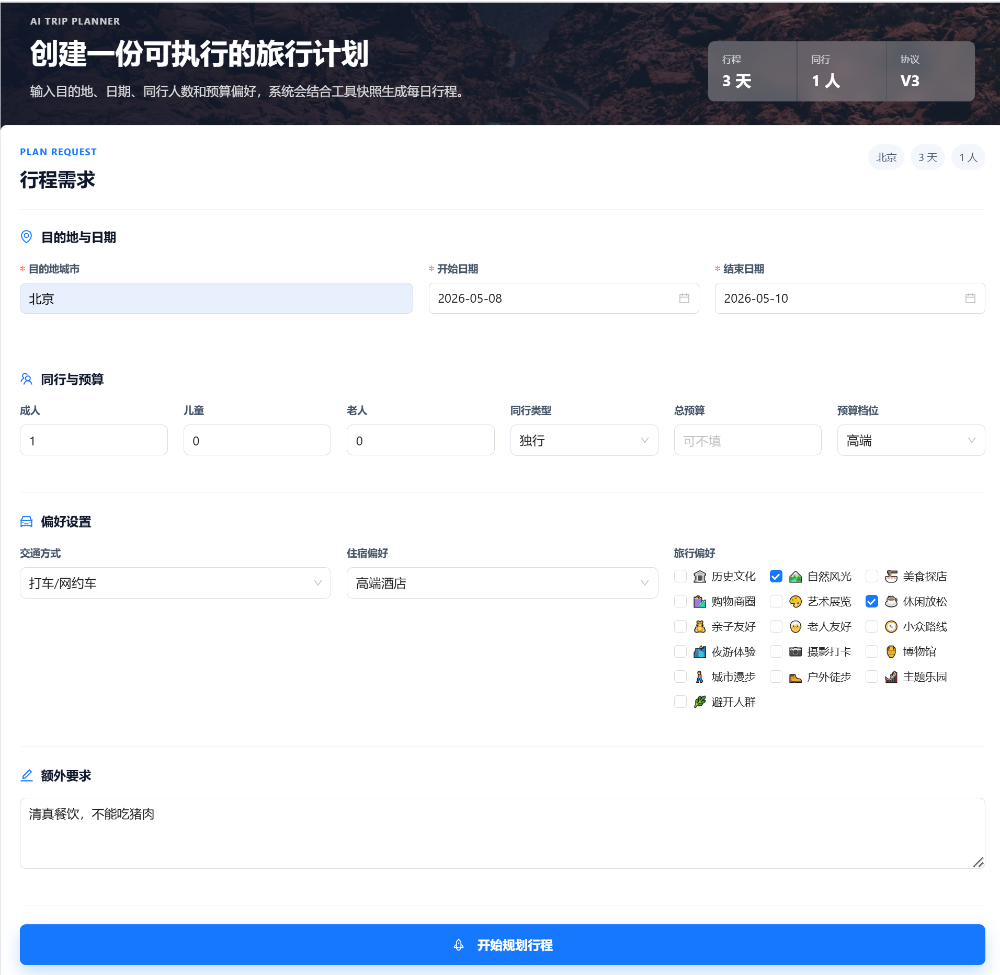
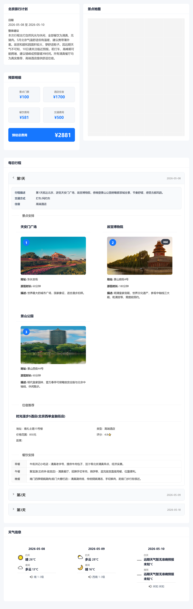

# HelloAgents Trip Planner

一个面向真实旅行规划场景的智能旅行助手。仓库里有可运行的 Web 应用、FastAPI 后端、基于高德地图的结构化工具快照，也保留了后训练数据和评测口径。

当前公开仓库聚焦稳定的 Planner 主线：后端把用户请求、人数、预算、住宿、天气、景点、酒店、餐饮和价格 hint 编译成可审计的 `PlannerContext`，Planner 模型再在这些约束内生成结构化 `TripPlan JSON`。历史实验管线、私有交流记录、模型权重、训练 checkpoint、运行日志和本地密钥不会上传。

## 功能

- 生成多日旅行计划：目的地、日期、同行人数、预算、交通、住宿和偏好共同约束输出。
- 结构化工具快照：后端收集景点、酒店、餐饮、天气、价格 hint 和候选计数，减少模型自由编造。
- 预算账本训练口径：显式区分酒店单房每晚价、景点成人票价、餐饮单人单餐价和同行人数。
- Web 交互界面：Vue 3 + TypeScript + Ant Design Vue，支持旅行需求填写和结果展示。
- 后训练资产：包含 SFT 数据、冻结评估集、规则评测指标、baseline 汇总和数据生成脚本。

## 界面预览

旅行请求填写：



旅行计划结果：



## 技术栈

后端：

- FastAPI
- HelloAgents `SimpleAgent`
- 高德地图 HTTP API / amap MCP 辅助接口
- OpenAI-compatible LLM 服务
- Pydantic schema 校验

前端：

- Vue 3
- TypeScript
- Vite
- Ant Design Vue
- 高德地图 Web JS API

训练与评测：

- LLaMA-Factory 数据格式
- `PlannerContext` 协议
- 规则评测脚本
- SFT / DPO 数据准备脚本

## 目录结构

完整目录职责和本地/公开资产边界见 [PROJECT_STRUCTURE.md](PROJECT_STRUCTURE.md)。

```text
helloagents-trip-planner/
├── backend/
│   ├── app/
│   │   ├── agents/          # Planner Agent、prompt 和生成失败反馈
│   │   ├── api/             # FastAPI 路由
│   │   ├── models/          # TripRequest / TripPlan schema
│   │   ├── planner/         # PlannerContext、预算、票价、路线和输出校验
│   │   └── services/        # LLM、高德、图片等服务封装
│   ├── requirements.txt
│   └── run.py
├── docs/
│   └── images/              # README 展示截图
├── frontend/
│   ├── src/
│   │   ├── services/
│   │   ├── types/
│   │   └── views/
│   ├── package.json
│   └── vite.config.ts
├── skills/               # Codex 本地工作流技能
├── training/
│   ├── configs/             # 按模型分组的训练配置
│   ├── data/                # 训练/评估数据
│   ├── docs/                # 协议、指标和后训练说明
│   ├── outputs/eval/        # 公开的评测汇总
│   ├── prompts/             # 数据生成 prompt
│   └── scripts/             # 训练脚本，按 shared/serving/validation 和当前任务分组
├── PROJECT_STRUCTURE.md  # 项目级目录索引
└── README.md
```

## 快速开始

### 前置条件

- Python 3.11
- Node.js 22 或兼容版本
- 高德地图 API Key
- OpenAI-compatible LLM API Key
- 可选：Unsplash API Key，用于景点图片

### 后端

```bash
cd helloagents-trip-planner/backend
python -m venv .venv
source .venv/bin/activate
pip install -r requirements.txt
cp .env.example .env
```

编辑 `backend/.env`，至少配置：

```bash
AMAP_API_KEY=your_amap_api_key
LLM_MODEL_ID=your_model_name
LLM_API_KEY=your_llm_api_key
LLM_BASE_URL=your_openai_compatible_base_url
```

启动服务：

```bash
python run.py
```

默认地址：

- API: `http://localhost:7000`
- Swagger: `http://localhost:7000/docs`
- Health check: `http://localhost:7000/health`

### 前端

```bash
cd helloagents-trip-planner/frontend
npm ci
cp .env.example .env
```

编辑 `frontend/.env`：

```bash
VITE_API_BASE_URL=http://localhost:7000
VITE_AMAP_WEB_KEY=your_amap_web_key
VITE_AMAP_WEB_JS_KEY=your_amap_web_js_key
```

启动开发服务：

```bash
npm run dev -- --host 0.0.0.0 --port 5173
```

默认地址：

- Web: `http://localhost:5173`

## API 概览

启动后端后可以访问 `http://localhost:7000/docs` 查看完整 OpenAPI 文档。主要接口：

- `POST /api/trip/plan`：生成旅行计划
- `GET /api/trip/health`：检查 Planner 服务
- `GET /api/map/poi`：搜索 POI
- `GET /api/map/weather`：查询天气
- `POST /api/map/route`：规划路线
- `GET /api/poi/detail/{poi_id}`：获取 POI 详情
- `GET /api/poi/photo`：获取景点图片

## 后训练资产

`training/` 目录记录训练和评测主线。这里的做法是先由后端生成稳定、可审计的 `PlannerContext`，再让模型学习把它转换成合法的 `TripPlan JSON`。

推荐入口：

- [training/docs/教程/旅行助手后训练实战教程.md](training/docs/教程/旅行助手后训练实战教程.md)：从 PlannerContext 到 SFT、Best-of-N 和评测的实战教程
- [training/README.md](training/README.md)：后训练目录说明
- [training/STRUCTURE.md](training/STRUCTURE.md)：训练资产、数据、脚本、报告的目录边界
- [training/docs/README.md](training/docs/README.md)：长期文档索引
- [training/outputs/eval/README.md](training/outputs/eval/README.md)：评测输出与公开报告索引
- [training/outputs/eval/reports/260512_bestofn_replay_extended_w10/README.md](training/outputs/eval/reports/260512_bestofn_replay_extended_w10/README.md)：2026-05-12 当前评测报告包

当前仓库保留主线材料，不上传历史数据、私有交流记录、模型权重、checkpoint 和大规模运行产物。

## 安全与忽略规则

不要提交真实密钥。`.gitignore` 已经排除了这些内容：

- `backend/.env`、`frontend/.env`
- Python / Node 本地环境
- `node_modules/`、构建产物、日志
- 训练输出、模型权重、checkpoint
- 历史管线和废弃 prompt 消融
- 私有作者交流、会话记忆和临时文档

`.env.example` 会保留在仓库中，作为配置模板。

## 许可证

CC BY-NC-SA 4.0

## 致谢

- [HelloAgents](https://github.com/datawhalechina/Hello-Agents)
- [高德地图开放平台](https://lbs.amap.com/)
- [amap-mcp-server](https://github.com/sugarforever/amap-mcp-server)
