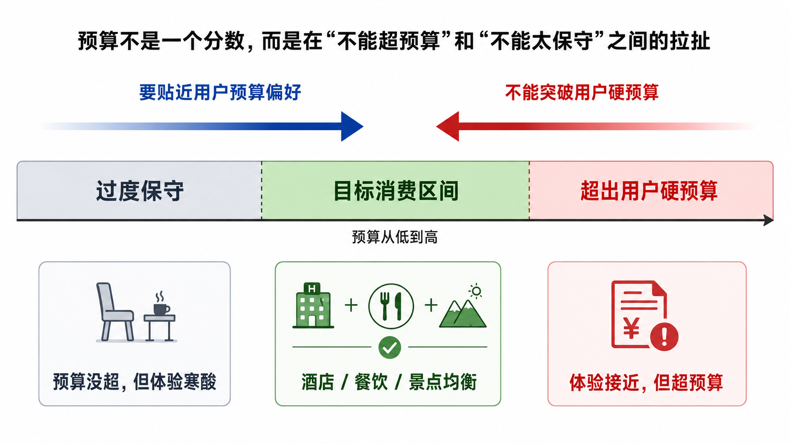
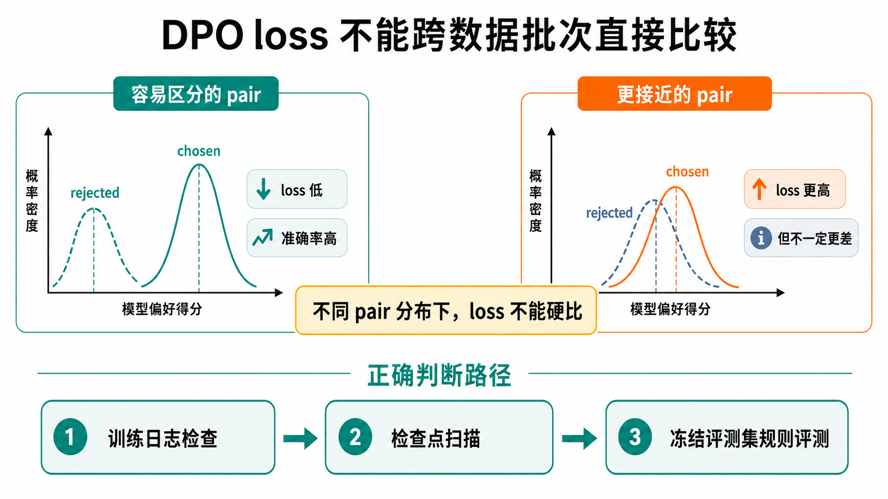

# 强化学习阶段踩坑记录与经验总结

更新时间：2026-05-22

这篇不是 DPO 训练日志。训练日志已经放在 [DPO阶段实验归档](../后训练产物/03_DPO阶段/) 里，那里适合查某一轮用了什么数据、什么参数、哪个 checkpoint。这里更像复盘：强化学习阶段到底踩了哪些坑，下次再做一个规则可评估的 Planner 模型，哪些事应该一开始就想清楚。

先说结论：这一阶段最容易误判的地方，不是“DPO 有没有用”，而是“我到底在优化什么”。如果指标、pair、评估集、推理方式没说清，训练会给出很漂亮但没法解释的分数。

## 先记住几句话

- `hard_pass` 是门槛，不是好计划。
- `planner_soft_pass` 更接近旅行体验，但不能直接当唯一奖励。
- eval 失败样本只能拿来诊断，不能顺手拿去训练。
- DPO pair 要干净，模型才知道自己该学什么。
- 单生成最优和 rerank 最优可能不是同一个 checkpoint。

## 1. 只看 hard pass，会把模型看得太好

`hard_pass` 很重要。JSON 能解析，schema 没错，城市、日期、POI grounding 都对，这些是旅行规划器的底线。

但它只能说明“这份计划能被系统吃下去”，不能说明它像一个好旅行规划师写出来的东西。我们后来见过不少 hard pass 的计划：景点合法但重复，餐厅合法但每天像随手填的，预算没超但高预算用户吃得很寒酸，预算表写得漂亮但按真实 POI 重算以后对不上。

所以强化学习阶段不能继续把 hard pass 当主目标。它应该是准入条件：先过 hard，再谈体验。

## 2. PlannerSoft 不是换个指标名，而是少骗自己

早期的 soft 指标主要看 `budget_preference_aligned`。这个指标有用，但它偏像“模型说自己符合预算”。真正上线以后，用户关心的是另一件事：你选的酒店、餐厅、景点加起来，到底是不是那个价位。

后来主目标改成 `planner_soft_pass`：

```text
planner_soft_pass =
  sft_hard_pass
  && attraction_diversity_ok
  && meal_diversity_ok
  && meal_cost_scale_ok
  && recomputed_budget_user_constraint_ok
  && recomputed_budget_fit_ok
```

这个定义朴素很多：先保证计划可用，再看景点和餐饮有没有变化，餐饮价格是否像这个预算档位，重算预算有没有超过用户硬约束，以及有没有贴近用户想要的消费档位。

这一步很值。`planner_soft_pass` 从 SFT final 的 35.2%，涨到 fd600 ckpt-25 的 44.7%，再到 260519 ckpt-138 单生成的 71.5%。这说明模型确实能学到这类规则偏好。

但也别神化它。`planner_soft_pass` 仍然是规则指标，不是真人满意度。它适合当主评估指标，不适合被孤零零地塞进 RL 里当 0/1 奖励。


## 3. 预算不是一个分数，是两件互相拉扯的事

预算最容易被写成一个模糊的 “budget bad”。这会把问题搅在一起。

至少要拆成两件事：

- 不能突破用户硬预算。
- 不能为了不超预算，把高预算用户安排得过分便宜。

前者是底线，后者是体验。只优化“不超预算”，模型会越来越保守；只优化“贴近预算档位”，模型又可能顶着用户硬预算往上冲。

后面我更愿意这样看：`recomputed_budget_user_constraint_ok` 管底线，`recomputed_budget_fit_ok` 管偏好。训练 pair 里也要标清楚失败类型，是超了用户硬预算，还是低于目标消费档位，还是预算边界处理不好。不要都塞进一个 budget bucket。



## 4. 餐饮价格尺度不能一刀切

高预算用户不能连续几天吃很便宜的午餐晚餐，这个判断没问题。但旅行不是财务报表。夜市、小吃街、老字号面馆、早点、甜品，本来就可能是体验的一部分。

如果规则写得太硬，模型会学得很怪：高预算就硬塞贵餐厅，反而失去地方感。

后来这条规则只重点管高预算档位的午餐和晚餐。早餐、甜品、本地小吃、夜市这类要豁免或降权。comfortable 档位也别过度收紧，真正要抓的是 luxury / high budget 里那种明显偷懒的低价正餐。

这个坑提醒我：soft 指标不是越严越好。规则如果不懂旅行，会把模型训得也不懂旅行。

## 5. DPO pair 少一点没关系，信号要干净

DPO 不是把 chosen 写好、rejected 写差就完事。最糟糕的 pair 是 chosen 和 rejected 什么都差：一个 JSON 正常，一个 JSON 烂掉；一个预算好、餐饮好、景点也好，另一个全错。模型看完以后只知道“左边更好”，但不知道为什么。

真正有用的 pair 最好长这样：

- chosen 过 hard pass，尽量过 planner soft。
- rejected 也尽量过 hard pass，只在一个明确维度失败。
- 每个 pair 标一个主失败原因，比如 `budget_fit`、`meal_scale`、`meal_diversity`、`attraction_diversity`。

这比盲目堆数量重要。直接把很烂的 rejected 扔进去，DPO 很容易只学会格式和显眼错误，学不到“合法计划之间怎么选更好”。

## 6. eval 失败样本很好用，但不能直接训练

eval 失败 case 很适合做诊断。它们能告诉你模型现在最常翻在哪些地方：预算偏保守、餐饮重复、景点重复，还是 hard split 上某类城市特别弱。

但不能把这些失败样本直接拿去造 DPO pair。那相当于把考题拿来补课，最后分数会变好，可信度会变差。

后面 closing budget clean 做对了一件事：先按冻结 eval 请求签名过滤，再从训练候选池里选 pair。那轮记录里 `selected_eval_signature_overlap = 0`。这行数字看着不起眼，其实很重要。没有它，后面的评估分数我会不太敢信。

下次再做，pair selection 前就应该建 frozen eval signature set。选完以后强制报告 overlap。这个步骤别靠自觉，应该写进脚本。


## 7. 继续训练不能只喂新数据

每次看到新造的数据质量更好，都会想全换掉。这很诱人，也很危险。

新数据往往专门修某一类问题，比如预算边界或餐饮价格。只喂它，模型可能把前一轮已经学好的能力冲掉。fd600 direct402 里修得很好的 meal scale、预算约束、grounding，都需要 replay anchor 稳住。

比较稳的做法是：新强信号数据做主菜，旧的高质量数据留一部分当 anchor，再加少量 hard-valid 普通样本稳结构。每批数据都跑分布报告，看失败类型、预算档位、城市、天数、同行人数，不要等训练完才发现数据偏了。

## 8. final checkpoint 经常不是最好的

fd600 direct402 那轮就是个很好的提醒。ckpt-25 综合最好，ckpt-30 某些指标更高，ckpt-35 明显回落，最后的 ckpt-40 也不是最佳选择。

如果当时只保留 final，就会错过更好的模型。

所以 DPO 阶段要按固定间隔存可评估 adapter。0.5 epoch 一个点是比较合适的起步。训练完不要只看 train loss，要扫所有 checkpoint，看 planner soft、hard split、budget fit、meal scale。最后选模型时，eval 比 “final” 这个名字更有发言权。

还有一个细节：`save_only_model: true` 存出来的是 adapter，不是完整 optimizer / scheduler / DeepSpeed 状态。它适合作为下一阶段初始化，不适合假装无缝 resume。这个区别要写清楚，不然后面排查学习率和训练曲线会很乱。

## 9. 单生成最优和 rerank 最优不是一回事

这次最有意思的反转在收尾阶段。

如果只看单生成，260519 `ps2400clean_plus_direct402 checkpoint-138` 是更稳的版本，combined `planner_soft_pass` 71.5%，hard pass 98.4%。后面的 closing budget 继续训，单生成没有继续涨：ckpt-66 回到 70.1%，ckpt-64 又到 69.7%。

按单生成口径，应该回到 ckpt-138。

但如果允许多温度候选加 rerank，260521 ckpt-64 反而更适合展示。它单次生成不如 ckpt-138，可它给 rerank 的候选池更好。rerank n4 后，ckpt-64 的 combined `planner_soft_pass` 到 80.6%，hard split planner soft 到 77.0%。

这说明 closing 数据不是白训了。它没有直接把单生成分数顶上去，但改变了候选分布。

所以报告里一定要把 single generation 和 rerank 分开写。单生成最佳、系统展示最佳，可以不是同一个 checkpoint。混在一起讲，会把自己绕进去。


## 10. DPO loss 不能跨数据批次横比

fd600 direct402 的 pair 差异更清楚，loss 下降比较顺。closing budget clean 的 pair 更接近，loss 看起来更高。这不代表 closing 那炉坏了，它只是更难。

DPO loss 只能在同一批数据里看趋势。跨数据集横比 loss，很容易得出错误结论。

真正要问的是：这批数据上 loss 有没有稳定下降，reward accuracy 有没有失真，checkpoint sweep 后目标指标有没有涨。如果 rule eval 没涨，训练日志再好看也没用；如果 rerank 后候选质量变好了，单生成 loss 也解释不了全部事情。



## 11. 工程坑会污染训练结论

强化学习阶段有不少坑并不“算法”，但它们会直接改变结论。

`max_tokens` 太小，生成会被截断；截断样本进 DPO，模型就会学到不完整输出。外部强模型 endpoint 不记录，后面就说不清数据到底来自哪。vLLM 并发靠拍脑袋，轻则吞吐低，重则显存炸。训练服务、评估服务、GPU 清理没有生命周期管理，最后会出现端口占用、显存没释放、日志不知道在哪。

这些问题听起来琐碎，但都可能让一个实验白跑。

后来比较可靠的做法是：生成阶段记录 `finish_reason`，length/truncated 默认不入训练；每批数据记录 provider、model、base url、max tokens、concurrency；vLLM workers 按服务启动时的 `Maximum concurrency` 调；每个服务写 pid、port、gpu、model path、log path，评估结束自动停。

## 12. 真要做 RL，也要先把奖励拆细

Planner 任务确实很像 contextual bandit：输入是 `PlannerContext`，输出是一份 `TripPlan`，规则 evaluator 能给分。

但这不代表下一步就该直接上 PPO。TripPlan 太长，失败原因又多，token-level credit assignment 很难。只用 `planner_soft_pass` 做 0/1 reward，也太稀疏。

更稳的顺序是：先继续 DPO，把高质量 pair 的收益吃完；然后做 Best-of-N + 规则奖励，用 evaluator 给多个候选打分；再小规模试 GRPO / RLOO。reward 要拆开写，至少区分 schema、hard pass、用户硬预算、预算 fit、餐饮/景点多样性、餐饮价格尺度。`meal_cost_scale_ok` 已经很高时，更适合做 guardrail，不要继续重压。

不要一上来做重型 RL。先把奖励函数、采样、评估和 checkpoint sweep 跑成闭环。

## 我会怎么重来一遍

如果重新做这个阶段，我会按这个顺序来：

1. 先冻结 eval records 和 evaluator 版本。
2. 把主目标定成 `planner_soft_pass`，但保留 hard pass 和预算约束做 guardrail。
3. 用 eval bad case 总结失败模式，不直接拿 eval 样本训练。
4. 从 train-only contexts 或训练候选池造 DPO pair，先做 signature anti-leak。
5. 让 rejected 尽量 hard-valid，只在一个 planner soft 维度失败。
6. 每批数据都写 summary：来源、失败类型、预算档位、城市、天数、party size、overlap。
7. 每 0.5 epoch 存 adapter，训练完 sweep，不默认 final 最好。
8. 单生成和 rerank 分开评估，分别选模型。
9. 只有当 DPO 收益变小，再考虑 Best-of-N reward 或 GRPO / RLOO。

最后一句话：强化学习阶段最重要的不是“再训一轮”，而是别让模型、数据、指标和推理方式互相替对方背锅。把这几件事拆清楚，分数才有意义。
