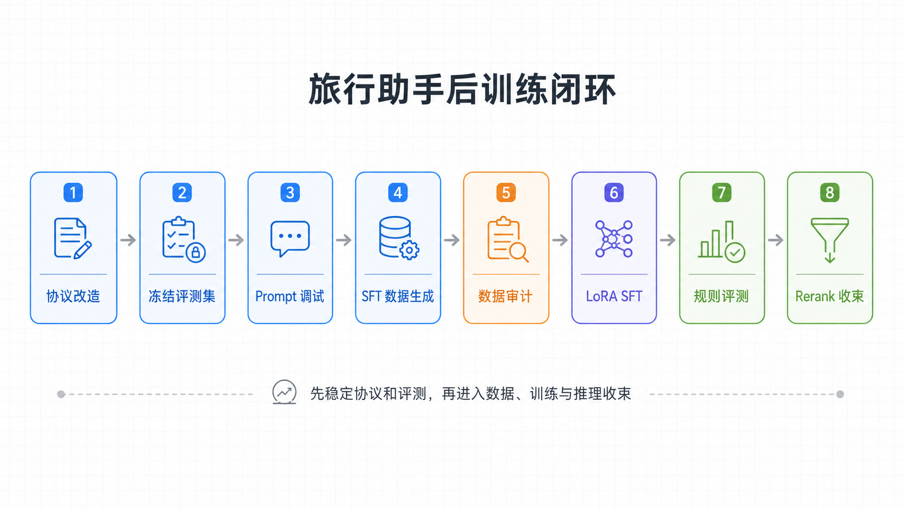
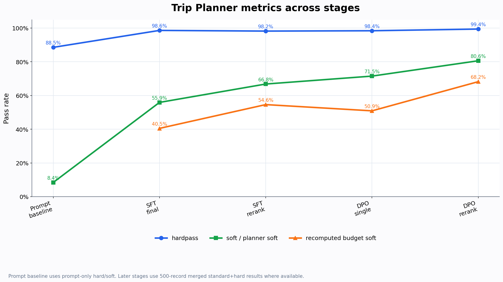
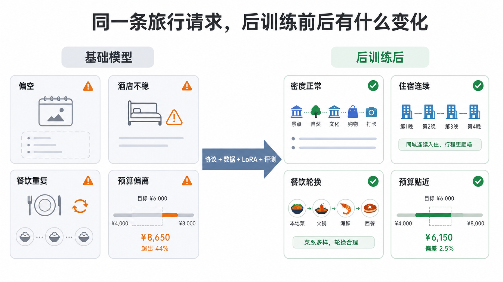
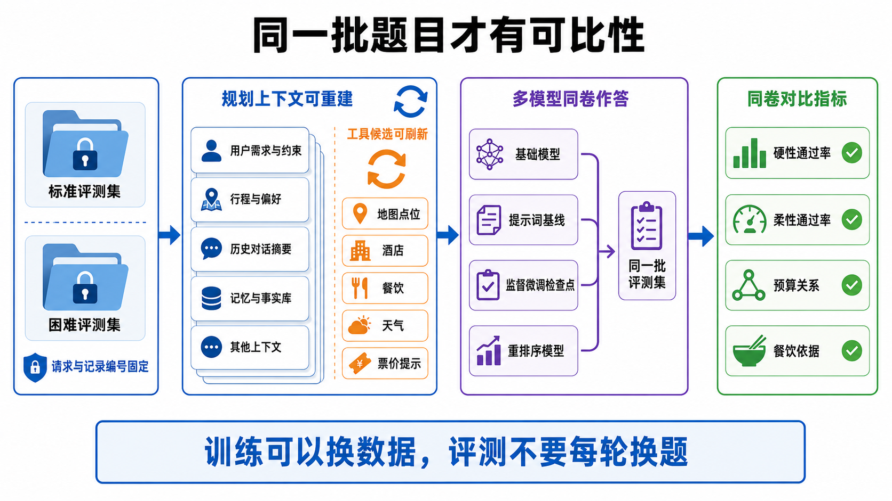
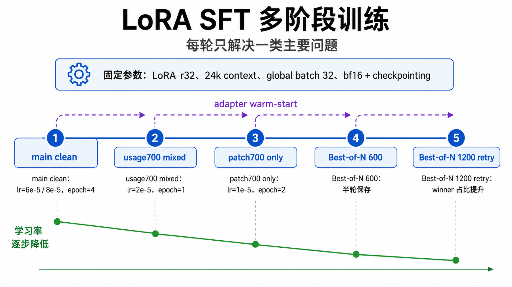
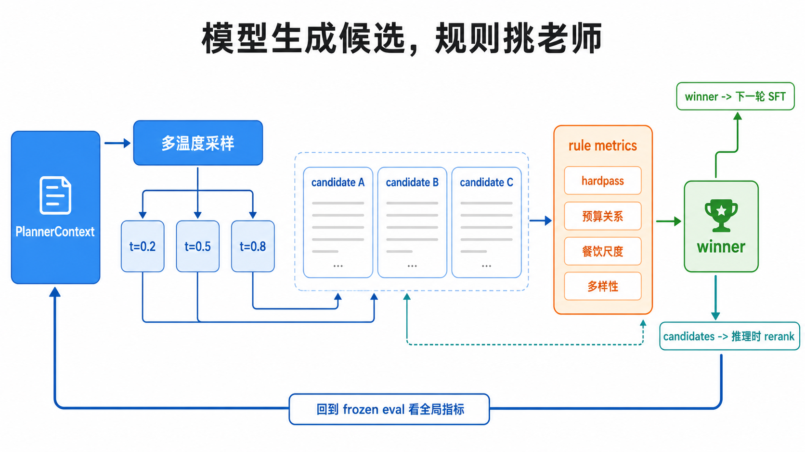
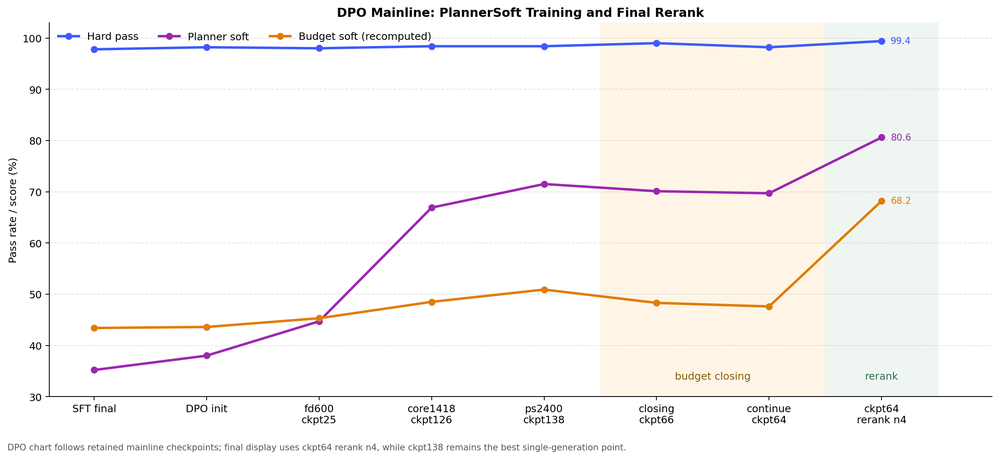
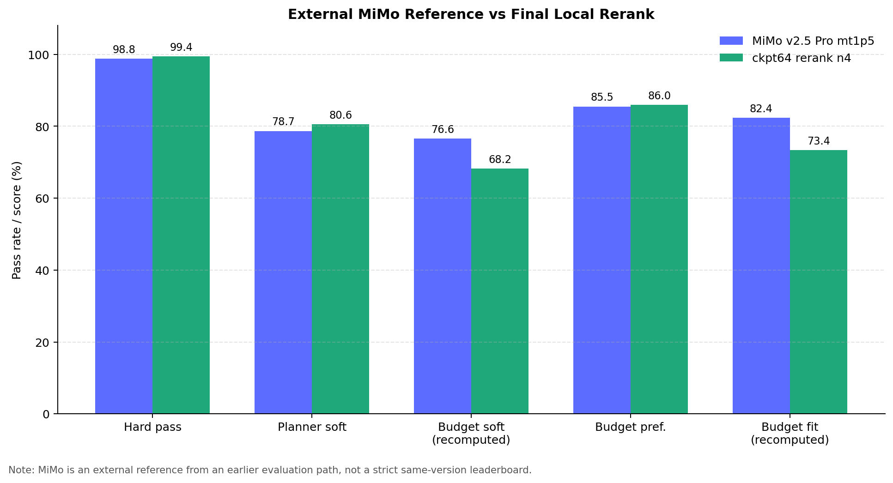

# 旅行助手后训练实战：从产品协议到 SFT、DPO 与 Rerank 收尾

旅行规划很会骗人。第一版 Demo 通常挺好看：用户说“我想去北京玩三天，预算 3000”，模型很快就能写出景点、酒店、餐厅和注意事项。光看文本，好像已经差不多了。

但只要把它接到真实前后端，再让用户多试几次，问题就会冒出来：

- 用户说的是整趟预算，模型可能按人均预算理解。
- 酒店价格应该是单间每晚，模型可能写成全程总价。
- 景点门票要乘同行人数，模型有时只算一张票。
- 餐厅看起来很具体，但并不在工具返回的候选里。
- 最后一天明明还在旅行，模型却把晚餐写成“返程无”。

HelloAgents Trip Planner 的后训练，就是围着这些问题展开的。我一开始也很想直接进入训练，毕竟跑 LoRA 最有“进度感”。后来发现顺序反了。输入协议不干净，评测集不固定，teacher 数据没审计，训练只会把问题放大。

这篇教程就按真实推进顺序写：先改前后端协议，再固定评测集；接着调 prompt，看看哪些问题只靠 prompt 能救；然后用强模型生成 SFT 数据并做审计；SFT 学会基本协议后，再用 DPO 学偏好，最后用多候选 rerank 收尾。

最后整理出来的路线是这样：

```text
  -> 前后端协议改造
  -> 冻结 standard / hard 评测集
  -> prompt 调试和失败画像
  -> 强模型生成 SFT 数据
  -> 数据审计与 LLaMA-Factory 导出
  -> LoRA SFT 多阶段训练
  -> DPO 偏好训练
  -> 规则评测、切片对比和 checkpoint 选择
  -> 多候选 rerank 和最终版本收束
```



这条路比“写个 prompt 然后训练”麻烦得多。好处也很实在：每一轮都能说清楚模型为什么变好、哪里又坏了、下一轮该补哪块。

跑到最后，我发现这个项目不能指望某个神奇 checkpoint 一把收尾。更靠谱的做法是分层处理：Prompt 固定协议，SFT 学会结构，DPO 学偏好，Rerank 在候选里选更稳的答案。下面这张图先给一个大概走势，细节后面慢慢拆。不要把它读成严格同口径排行榜，它更像实验路线图。



## 目录

- [开篇 Case：先看模型到底变好了什么](#开篇-case先看模型到底变好了什么)
- [0. 开始前：环境和资源](#0-开始前环境和资源)
- [1. 先改产品协议，而不是急着训练](#1-先改产品协议而不是急着训练)
- [2. 先构建评测集，把考试卷固定下来](#2-先构建评测集把考试卷固定下来)
- [3. Prompt 调试：先知道 prompt 的上限在哪里](#3-prompt-调试先知道-prompt-的上限在哪里)
- [4. 用强模型生成 SFT 数据：teacher 也要被审计](#4-用强模型生成-sft-数据teacher-也要被审计)
- [5. SFT 数据审计：能进训练集的才是老师](#5-sft-数据审计能进训练集的才是老师)
- [6. LoRA SFT 多阶段训练：每一轮只解决一类主要问题](#6-lora-sft-多阶段训练每一轮只解决一类主要问题)
- [7. Best-of-N Replay：让模型自己产生候选，再用规则挑老师](#7-best-of-n-replay让模型自己产生候选再用规则挑老师)
- [8. DPO：别让模型只会满足硬规则](#8-dpo别让模型只会满足硬规则)
- [9. 评测：不要只看一个总分](#9-评测不要只看一个总分)
- [10. 小结：后训练就是把问题分层](#10-小结后训练就是把问题分层)

## 开篇 Case：先看模型到底变好了什么

先放一条普通 case。不是为了证明模型有多强，只是先给一个手感：后训练前后，到底差在哪。

这条请求很日常：一个人去杭州玩 4 天，打车，住经济型酒店，想吃点本地美食，也看看城市地标。总预算 3500 元左右，而且不能超。

基础模型不是完全不会写。它能写出西湖、灵隐寺、城市阳台，也会给酒店和餐厅。但细看就会发现不太踏实：最后一天住宿没了，肯德基反复出现，预算也报得过低。看起来像旅行计划，真的拿给用户就有点悬。

最终版也不是满分，后面还能看到餐饮预算有 60 元小账误差。但它至少开始像一个认真排过的行程：酒店天数稳定，景点密度正常，餐厅也不再一路重复。下面先看压缩版对比，完整 JSON 我放在折叠块里，想核对的时候再展开。

### 一眼看懂版

| 观察点 | 基础模型 | 最终版 |
| --- | --- | --- |
| 行程密度 | 4 天基本每天 1 个景点，偏空 | 每天 2 到 3 个景点，西湖、断桥、雷峰塔、灵隐寺、西溪、清河坊都覆盖到 |
| 酒店 | 前 3 天有酒店，第 4 天写成“无住宿”，但预算里又按 4 晚算 | 前 3 晚稳定使用同一家 250 元经济型酒店，预算按 3 晚算 |
| 餐饮 | 肯德基重复较多，第 4 天午餐和晚餐还是同一家 | 餐厅有轮换，包含杭帮菜、海鲜、烤肉、面馆和少量快餐 |
| 预算 | 报 1840 元，离 3500 元 hard budget 太远，也有加总关系问题 | 报 2500 元，落在 limited hard case 的可接受区间下沿 |
| 规则评测 | 抓出 9 类错误 | 当前主要剩餐饮小账误差，`total_meals` 比规则重算多 60 元 |

只看这张表也能看出来，收益不在“文案更漂亮”，而在产品协议更稳：住宿天数、预算关系、餐饮重复、行程密度这些东西开始压住了。



图中预算数字用于表达前后对比关系，原始 case 的具体数值以本节表格和后面的 JSON 为准。

### 完整原始输出

下面三段是原始 JSON。平时读文章可以先跳过，做复现或审计时再展开。

<details open>
<summary>用户请求</summary>

```json
{
  "city": "杭州",
  "start_date": "2026-05-11",
  "end_date": "2026-05-14",
  "travel_days": 4,
  "transportation": "打车",
  "accommodation": "经济型酒店",
  "preferences": [
    "美食",
    "城市地标"
  ],
  "free_text_input": "单人自由行，总预算控制在3500元左右，节奏适中就行。",
  "party": {
    "adults": 1,
    "children": 0,
    "elders": 0,
    "total": 1,
    "companion_type": "solo"
  },
  "budget_constraint": {
    "amount": 3500,
    "scope": "total",
    "currency": "CNY",
    "budget_level": "limited",
    "strictness": "hard"
  }
}
```

</details>

<details>
<summary>基础模型完整返回</summary>

```json
{
  "city": "杭州",
  "start_date": "2026-05-11",
  "end_date": "2026-05-14",
  "days": [
    {
      "date": "2026-05-11",
      "day_index": 0,
      "description": "第1天：抵达杭州，入住酒店，游览西湖",
      "transportation": "打车",
      "accommodation": "经济型酒店",
      "hotel": {
        "name": "白云宾馆",
        "address": "春秋北路201号",
        "location": {
          "longitude": 119.943116,
          "latitude": 30.05851
        },
        "price_range": "250-300元",
        "rating": "4.8",
        "distance": "",
        "type": "经济型酒店",
        "estimated_cost": 250
      },
      "attractions": [
        {
          "name": "杭州西湖风景名胜区",
          "address": "西湖街道龙井路1号",
          "location": {
            "longitude": 120.121358,
            "latitude": 30.222692
          },
          "visit_duration": 120,
          "description": "游览西湖美景，感受杭州的自然风光",
          "category": "风景名胜",
          "ticket_price": 0
        }
      ],
      "meals": [
        {
          "type": "breakfast",
          "name": "酒店早餐",
          "description": "酒店提供的早餐",
          "estimated_cost": 30
        },
        {
          "type": "lunch",
          "name": "知味观(湖滨总店)",
          "description": "品尝杭州特色糕点",
          "estimated_cost": 68
        },
        {
          "type": "dinner",
          "name": "肯德基(杭州灵隐店)",
          "description": "快餐选择",
          "estimated_cost": 40
        }
      ]
    },
    {
      "date": "2026-05-12",
      "day_index": 1,
      "description": "第2天：游览灵隐寺，体验城市地标",
      "transportation": "打车",
      "accommodation": "经济型酒店",
      "hotel": {
        "name": "白云宾馆",
        "address": "春秋北路201号",
        "location": {
          "longitude": 119.943116,
          "latitude": 30.05851
        },
        "price_range": "250-300元",
        "rating": "4.8",
        "distance": "",
        "type": "经济型酒店",
        "estimated_cost": 250
      },
      "attractions": [
        {
          "name": "灵隐寺",
          "address": "法云弄1号",
          "location": {
            "longitude": 120.101406,
            "latitude": 30.240826
          },
          "visit_duration": 120,
          "description": "参观千年古刹，感受佛教文化",
          "category": "风景名胜",
          "ticket_price": 30
        }
      ],
      "meals": [
        {
          "type": "breakfast",
          "name": "酒店早餐",
          "description": "酒店提供的早餐",
          "estimated_cost": 30
        },
        {
          "type": "lunch",
          "name": "方老大",
          "description": "品尝杭州特色早餐",
          "estimated_cost": 54
        },
        {
          "type": "dinner",
          "name": "鸟鸟私房面(来福士臻选店)",
          "description": "体验本地特色面食",
          "estimated_cost": 25
        }
      ]
    },
    {
      "date": "2026-05-13",
      "day_index": 2,
      "description": "第3天：游览城市阳台，体验美食",
      "transportation": "打车",
      "accommodation": "经济型酒店",
      "hotel": {
        "name": "白云宾馆",
        "address": "春秋北路201号",
        "location": {
          "longitude": 119.943116,
          "latitude": 30.05851
        },
        "price_range": "250-300元",
        "rating": "4.8",
        "distance": "",
        "type": "经济型酒店",
        "estimated_cost": 250
      },
      "attractions": [
        {
          "name": "城市阳台",
          "address": "四季青街道之江路1078号",
          "location": {
            "longitude": 120.216803,
            "latitude": 30.241827
          },
          "visit_duration": 120,
          "description": "欣赏城市美景，体验现代都市风光",
          "category": "风景名胜",
          "ticket_price": 0
        }
      ],
      "meals": [
        {
          "type": "breakfast",
          "name": "酒店早餐",
          "description": "酒店提供的早餐",
          "estimated_cost": 30
        },
        {
          "type": "lunch",
          "name": "柳来原味螺蛳粉(枫香路店)",
          "description": "品尝杭州特色小吃",
          "estimated_cost": 31
        },
        {
          "type": "dinner",
          "name": "肯德基(市民中心1号店)",
          "description": "快餐选择",
          "estimated_cost": 31
        }
      ]
    },
    {
      "date": "2026-05-14",
      "day_index": 3,
      "description": "第4天：返程",
      "transportation": "打车",
      "accommodation": "无住宿",
      "hotel": null,
      "attractions": [
        {
          "name": "杭州植物园",
          "address": "桃源岭1号",
          "location": {
            "longitude": 120.117009,
            "latitude": 30.25291
          },
          "visit_duration": 120,
          "description": "游览植物园，感受自然之美",
          "category": "公园",
          "ticket_price": 10
        }
      ],
      "meals": [
        {
          "type": "breakfast",
          "name": "酒店早餐",
          "description": "酒店提供的早餐",
          "estimated_cost": 30
        },
        {
          "type": "lunch",
          "name": "肯德基(市民中心1号店)",
          "description": "快餐选择",
          "estimated_cost": 31
        },
        {
          "type": "dinner",
          "name": "肯德基(市民中心1号店)",
          "description": "快餐选择",
          "estimated_cost": 31
        }
      ]
    }
  ],
  "weather_info": [
    {
      "date": "2026-05-11",
      "day_weather": "多云",
      "night_weather": "多云",
      "day_temp": 31,
      "night_temp": 21,
      "wind_direction": "西南",
      "wind_power": "1-3级"
    },
    {
      "date": "2026-05-12",
      "day_weather": "多云",
      "night_weather": "多云",
      "day_temp": 33,
      "night_temp": 21,
      "wind_direction": "东北",
      "wind_power": "1-3级"
    },
    {
      "date": "2026-05-13",
      "day_weather": "多云",
      "night_weather": "多云",
      "day_temp": 31,
      "night_temp": 23,
      "wind_direction": "东",
      "wind_power": "1-3级"
    },
    {
      "date": "2026-05-14",
      "day_weather": "多云",
      "night_weather": "多云",
      "day_temp": 33,
      "night_temp": 23,
      "wind_direction": "东南",
      "wind_power": "1-3级"
    }
  ],
  "overall_suggestions": "本行程安排了杭州的主要景点和美食，确保了合理的预算和节奏。建议根据实际情况调整餐饮选择，以适应个人口味。",
  "budget": {
    "total_attractions": 120,
    "total_hotels": 1000,
    "total_meals": 420,
    "total_transportation": 200,
    "total": 1840
  }
}
```

</details>

<details>
<summary>最终版完整返回</summary>

```json
{
  "city": "杭州",
  "start_date": "2026-05-11",
  "end_date": "2026-05-14",
  "days": [
    {
      "date": "2026-05-11",
      "day_index": 0,
      "description": "抵达杭州，入住酒店后游览西湖经典景点，感受城市地标与湖光山色。",
      "transportation": "打车",
      "accommodation": "经济型酒店",
      "hotel": {
        "name": "可见时光·望达斯旅舍(杭州西湖湖滨河坊街店)",
        "address": "小井巷21号(吴山广场地铁站D口步行360米)",
        "location": {
          "longitude": 120.168087,
          "latitude": 30.239811
        },
        "price_range": "250元",
        "rating": "4.6",
        "distance": "",
        "type": "经济型酒店",
        "estimated_cost": 250
      },
      "attractions": [
        {
          "name": "杭州西湖风景名胜区",
          "address": "西湖街道龙井路1号",
          "location": {
            "longitude": 120.121358,
            "latitude": 30.222692
          },
          "visit_duration": 120,
          "description": "世界文化遗产，杭州城市地标，可漫步苏堤、白堤，欣赏湖光山色。",
          "category": "风景名胜;国家级景点",
          "rating": null,
          "photos": [],
          "poi_id": "",
          "image_url": null,
          "ticket_price": 0
        },
        {
          "name": "杭州西湖风景名胜区-断桥残雪",
          "address": "龙井路1号杭州西湖风景名胜区内(东北角)",
          "location": {
            "longitude": 120.151347,
            "latitude": 30.258151
          },
          "visit_duration": 60,
          "description": "西湖十景之一，白娘子传说地，可赏湖景与断桥风情。",
          "category": "风景名胜;国家级景点",
          "rating": null,
          "photos": [],
          "poi_id": "",
          "image_url": null,
          "ticket_price": 0
        },
        {
          "name": "雷峰塔景区",
          "address": "南山路15号",
          "location": {
            "longitude": 120.148849,
            "latitude": 30.230934
          },
          "visit_duration": 90,
          "description": "西湖标志性建筑，登塔可俯瞰西湖全景，了解白蛇传传说。",
          "category": "风景名胜;国家级景点",
          "rating": null,
          "photos": [],
          "poi_id": "",
          "image_url": null,
          "ticket_price": 40
        }
      ],
      "meals": [
        {
          "type": "breakfast",
          "name": "知味观(湖滨总店)",
          "address": "仁和路83-1号",
          "location": {
            "longitude": 120.163591,
            "latitude": 30.252629
          },
          "description": "杭州老字号，品尝小笼包、猫耳朵等传统糕点。",
          "estimated_cost": 68
        },
        {
          "type": "lunch",
          "name": "赵府私厨·老杭帮菜(西湖老店)",
          "address": "学士路92号",
          "location": {
            "longitude": 120.161265,
            "latitude": 30.255517
          },
          "description": "地道杭帮菜，推荐东坡肉、龙井虾仁。",
          "estimated_cost": 69
        },
        {
          "type": "dinner",
          "name": "黄龙海鲜大排档(杭州总店)",
          "address": "玉古路178号(黄龙体育中心西门)",
          "location": {
            "longitude": 120.131407,
            "latitude": 30.269103
          },
          "description": "新鲜海鲜大排档，体验杭州夜宵文化。",
          "estimated_cost": 160
        }
      ]
    },
    {
      "date": "2026-05-12",
      "day_index": 1,
      "description": "上午前往灵隐寺祈福，下午游览植物园，感受自然与文化。",
      "transportation": "打车",
      "accommodation": "经济型酒店",
      "hotel": {
        "name": "可见时光·望达斯旅舍(杭州西湖湖滨河坊街店)",
        "address": "小井巷21号(吴山广场地铁站D口步行360米)",
        "location": {
          "longitude": 120.168087,
          "latitude": 30.239811
        },
        "price_range": "250元",
        "rating": "4.6",
        "distance": "",
        "type": "经济型酒店",
        "estimated_cost": 250
      },
      "attractions": [
        {
          "name": "灵隐寺",
          "address": "法云弄1号",
          "location": {
            "longitude": 120.101406,
            "latitude": 30.240826
          },
          "visit_duration": 120,
          "description": "千年古刹，杭州城市地标，可祈福、参观佛像。",
          "category": "风景名胜;国家级景点",
          "rating": null,
          "photos": [],
          "poi_id": "",
          "image_url": null,
          "ticket_price": 30
        },
        {
          "name": "杭州植物园",
          "address": "桃源岭1号",
          "location": {
            "longitude": 120.117009,
            "latitude": 30.25291
          },
          "visit_duration": 90,
          "description": "植物种类丰富，适合漫步赏花，感受自然生态。",
          "category": "公园广场;植物园",
          "rating": null,
          "photos": [],
          "poi_id": "",
          "image_url": null,
          "ticket_price": 10
        }
      ],
      "meals": [
        {
          "type": "breakfast",
          "name": "肯德基(杭州灵隐店)",
          "address": "灵隐路38号",
          "location": {
            "longitude": 120.106426,
            "latitude": 30.24054
          },
          "description": "快捷早餐，方便出发前往灵隐寺。",
          "estimated_cost": 40
        },
        {
          "type": "lunch",
          "name": "传家(骆家庄西苑一区店)",
          "address": "文一西路551号骆家庄西苑一区1层",
          "location": {
            "longitude": 120.092815,
            "latitude": 30.286583
          },
          "description": "本地菜馆，品尝地道杭州味道。",
          "estimated_cost": 80
        },
        {
          "type": "dinner",
          "name": "肉本家·炭烤肉(杭州浙大总店)",
          "address": "紫荆花北路宝港生活广场1楼188号",
          "location": {
            "longitude": 120.092541,
            "latitude": 30.306813
          },
          "description": "韩国炭烤肉，氛围热闹，适合单人小聚。",
          "estimated_cost": 106
        }
      ]
    },
    {
      "date": "2026-05-13",
      "day_index": 2,
      "description": "上午游览西溪湿地，下午参观南宋德寿宫遗址博物馆，感受历史与湿地生态。",
      "transportation": "打车",
      "accommodation": "经济型酒店",
      "hotel": {
        "name": "可见时光·望达斯旅舍(杭州西湖湖滨河坊街店)",
        "address": "小井巷21号(吴山广场地铁站D口步行360米)",
        "location": {
          "longitude": 120.168087,
          "latitude": 30.239811
        },
        "price_range": "250元",
        "rating": "4.6",
        "distance": "",
        "type": "经济型酒店",
        "estimated_cost": 250
      },
      "attractions": [
        {
          "name": "西溪国家湿地公园",
          "address": "天目山路518号",
          "location": {
            "longitude": 120.061159,
            "latitude": 30.255079
          },
          "visit_duration": 180,
          "description": "城市湿地公园，可乘船游览，体验自然野趣。",
          "category": "风景名胜;国家级景点",
          "rating": null,
          "photos": [],
          "poi_id": "",
          "image_url": null,
          "ticket_price": 80
        },
        {
          "name": "南宋德寿宫遗址博物馆",
          "address": "望江路228-264号(江城路地铁站E口步行460米)",
          "location": {
            "longitude": 120.173273,
            "latitude": 30.238678
          },
          "visit_duration": 90,
          "description": "展示南宋历史文化，适合了解杭州古代文明。",
          "category": "博物馆;博物馆",
          "rating": null,
          "photos": [],
          "poi_id": "",
          "image_url": null,
          "ticket_price": 0
        }
      ],
      "meals": [
        {
          "type": "breakfast",
          "name": "方老大",
          "address": "江城路629号(地铁站H口步行350米)",
          "location": {
            "longitude": 120.176152,
            "latitude": 30.235695
          },
          "description": "杭州本地早餐，提供小笼包、馄饨等。",
          "estimated_cost": 54
        },
        {
          "type": "lunch",
          "name": "李白图书馆餐厅(西溪湿地店)",
          "address": "五常街道访溪路66号",
          "location": {
            "longitude": 120.047748,
            "latitude": 30.275877
          },
          "description": "湿地旁的特色餐厅，环境优雅，菜品精致。",
          "estimated_cost": 112
        },
        {
          "type": "dinner",
          "name": "乔村二十八道(钱江世纪城店)",
          "address": "盈丰街道左右商务中心2幢",
          "location": {
            "longitude": 120.255346,
            "latitude": 30.236941
          },
          "description": "老字号餐厅，菜品丰富，适合晚餐小聚。",
          "estimated_cost": 140
        }
      ]
    },
    {
      "date": "2026-05-14",
      "day_index": 3,
      "description": "上午游览城市阳台，下午漫步清河坊历史文化街区，傍晚返程。",
      "transportation": "打车",
      "accommodation": "经济型酒店",
      "hotel": null,
      "attractions": [
        {
          "name": "城市阳台",
          "address": "四季青街道之江路1078号",
          "location": {
            "longitude": 120.216803,
            "latitude": 30.241827
          },
          "visit_duration": 60,
          "description": "钱塘江畔城市地标，可欣赏江景与城市风光。",
          "category": "风景名胜;风景名胜",
          "rating": null,
          "photos": [],
          "poi_id": "",
          "image_url": null,
          "ticket_price": 0
        },
        {
          "name": "清河坊历史文化特色街区",
          "address": "河坊街180号",
          "location": {
            "longitude": 120.169899,
            "latitude": 30.239827
          },
          "visit_duration": 90,
          "description": "杭州历史文化街区，可购物、品尝小吃，感受老杭州风情。",
          "category": "风景名胜;国家级景点",
          "rating": null,
          "photos": [],
          "poi_id": "",
          "image_url": null,
          "ticket_price": 0
        }
      ],
      "meals": [
        {
          "type": "breakfast",
          "name": "王繁星面馆(杭州湖滨in77店)",
          "address": "延安路245号杭州湖滨银泰in77-B区B1",
          "location": {
            "longitude": 120.163391,
            "latitude": 30.25457
          },
          "description": "面馆早餐，提供多种面食选择。",
          "estimated_cost": 36
        },
        {
          "type": "lunch",
          "name": "江南忆味主题餐厅",
          "address": "湖滨街道国货路71号",
          "location": {
            "longitude": 120.164774,
            "latitude": 30.248993
          },
          "description": "特色餐厅，菜品融合江南风味。",
          "estimated_cost": 64
        },
        {
          "type": "dinner",
          "name": "肯德基(市民中心1号店)",
          "address": "灵隐路38号",
          "location": {
            "longitude": 120.106426,
            "latitude": 30.24054
          },
          "description": "返程前快餐，方便快捷。",
          "estimated_cost": 31
        }
      ]
    }
  ],
  "weather_info": [
    {
      "date": "2026-05-11",
      "day_weather": "多云",
      "night_weather": "多云",
      "day_temp": 31,
      "night_temp": 21,
      "wind_direction": "西南",
      "wind_power": "1-3级"
    },
    {
      "date": "2026-05-12",
      "day_weather": "多云",
      "night_weather": "多云",
      "day_temp": 33,
      "night_temp": 21,
      "wind_direction": "东北",
      "wind_power": "1-3级"
    },
    {
      "date": "2026-05-13",
      "day_weather": "多云",
      "night_weather": "多云",
      "day_temp": 31,
      "night_temp": 23,
      "wind_direction": "东",
      "wind_power": "1-3级"
    },
    {
      "date": "2026-05-14",
      "day_weather": "多云",
      "night_weather": "多云",
      "day_temp": 33,
      "night_temp": 23,
      "wind_direction": "东南",
      "wind_power": "1-3级"
    }
  ],
  "overall_suggestions": "行程以西湖为核心，结合城市地标与自然景观，节奏适中。预算控制在3500元以内，实际总花费约2500元，符合经济型酒店与单人自由行的定位。餐饮选择多样，涵盖杭帮菜、海鲜、烤肉等，体验杭州美食文化。建议提前预订热门景点门票，打车出行方便快捷。",
  "budget": {
    "total_attractions": 160,
    "total_hotels": 750,
    "total_meals": 1020,
    "total_transportation": 570,
    "total": 2500
  }
}
```

</details>

### 对照时看什么

基础模型的问题不是“完全不会写”。它知道西湖、灵隐寺、城市阳台，也会给酒店和餐厅。但它更像是在把几个看起来合理的字段拼起来，细看会露出很多缝：

- 每天基本只有一个景点，四天行程显得很空。
- 第 4 天写成“无住宿”，但 `budget.total_hotels` 又报了 1000 元，和前面 250 元一晚的酒店不匹配。
- 肯德基在第 3 天晚餐、第 4 天午餐和晚餐连续出现，第 4 天午晚餐还是同一家。
- 预算总额只有 1840 元。用户给的是 3500 元硬预算，省钱不是问题，但这已经不像一趟“预算控制在 3500 左右”的中等节奏杭州行。
- 规则评测最后抓出了 9 类错误，包括餐饮重复、酒店预算、预算加总、景点预算、餐饮预算和预算偏好不匹配。

最终版也不是满分，但明显更像一份能交给用户的计划：前三晚酒店稳定在同一家 250 元经济型酒店；景点从一天一个变成了西湖、断桥、雷峰塔、灵隐寺、植物园、西溪、德寿宫、城市阳台、清河坊这样的组合；餐厅也开始轮换，有杭帮菜、海鲜、烤肉、湿地附近餐厅、面馆和快餐。预算报到 2500 元，刚好落在这类 limited hard case 的可接受区间下沿。

当前规则评测还能抓到一个小账问题：返回里 `budget.total_meals` 是 1020 元，规则重算是 960 元，相差 60 元。别把这个例子理解成“训练后就完美了”。更真实的收益是：先把用户一眼能看出来的错压下去，再用固定指标继续追剩下的细账。更细的 POI 字段一致性，后面也可以继续加规则。

后面讲 hardpass、softpass、预算关系和切片评测，其实都在做同一件事：把这种肉眼能看出来的差别，变成一批 case 上可以稳定比较的数字。

对应报告可以看：

- `training/docs/后训练产物/02_SFT阶段/01_Clean_SFT训练/报告/base/standard/rule_eval_report.md`
- `training/docs/后训练产物/04_Rerank阶段/01_SFT多温度候选Rerank/报告/final1200/standard/rule_eval_report.md`

## 0. 开始前：环境和资源

建议先把环境配好再往下做。旅行助手后训练不是跑一个 notebook，它会同时用到前后端协议、地图候选、强模型数据生成、规则评测和 LoRA 训练。环境没理顺，后面每一步都会变成排错。

### 0.1 基础环境

我这里用的是：

| 组件 | 建议版本或说明 |
| --- | --- |
| Python | 3.11 |
| Node.js | 22 或兼容版本，用于跑前端 |
| 地图服务 | 高德地图 API Key，用来构建 POI、路线和天气候选 |
| 强模型接口 | OpenAI-compatible 或 DeepSeek 风格接口，用来生成 SFT 数据、补票价、做少量 judge |
| 训练框架 | LLaMA-Factory，训练脚本默认它在项目同级目录 `../LLaMA-Factory` |
| 基座模型 | Qwen2.5-7B-Instruct |

先准备训练环境：

```bash
cd helloagents-trip-planner
python -m venv .venv-training-py311
source .venv-training-py311/bin/activate
pip install -r training/requirements-training.txt
```

如果 LLaMA-Factory 不在项目同级目录，启动训练前显式指定：

```bash
export LLAMAFACTORY_ROOT=/path/to/LLaMA-Factory
```

训练、评测和数据生成都会读取 `backend/.env` 或项目根目录 `.env`。最少要有地图 key：

```bash
AMAP_API_KEY=your_amap_api_key
```

如果要让强模型生成 SFT 数据，再加一组数据生成专用变量。建议和后端线上 LLM 配置分开，方便单独统计 token 成本：

```bash
DATA_GEN_API_KEY=your_data_generation_key
DATA_GEN_BASE_URL=your_openai_compatible_base_url
DATA_GEN_MODEL=your_model_name
DATA_GEN_REASONING_EFFORT=low
DATA_GEN_THINKING=false
```

如果要完整跑前后端，还需要按项目 README 配后端和前端：

```bash
# backend/.env
LLM_MODEL_ID=your_model_name
LLM_API_KEY=your_llm_api_key
LLM_BASE_URL=your_openai_compatible_base_url

# frontend/.env
VITE_API_BASE_URL=http://localhost:7000
VITE_AMAP_WEB_KEY=your_amap_web_key
VITE_AMAP_WEB_JS_KEY=your_amap_web_js_key
```

### 0.2 配套数据下载

仓库里会保留教程、代码和一部分已经整理好的报告。为了方便读者直接对照数据跑流程，我也把一份后训练数据单独放到了网盘：

- 名称：`helloagents-后训练数据`
- 链接：<https://pan.baidu.com/s/5oNsK7pwQnqzQEUg5ykb09Q>

这份数据适合配着教程看：前期先对照评测报告和样例输出，后面真要复现 LoRA，再把本地路径替换成自己下载后的数据路径。实际训练时，还是建议保留每一轮的 `manifest`、usage 和审计报告。这些文件能说明数据从哪来、过滤掉了什么、最后进训练集的是哪一批。

如果网盘数据和仓库里的 `training/docs/后训练产物` 有细节差异，以教程里对应阶段的说明和本地 `manifest` 为准。网盘只是方便上手的材料包，不替代实验记录。

### 0.3 大概要多少资源

资源可以分档准备，不是每一步都要 4 张 GPU。

| 你要做什么 | 大概资源 |
| --- | --- |
| 只读教程、跑 schema 校验、看评测报告 | 普通开发机即可，不需要 GPU |
| 构建 `PlannerContext`、生成 standard / hard 评测集 | CPU + 高德 API Key；建议 16GB 内存起步，worker 先开 1 到 4 |
| 调 prompt、调用强模型生成 SFT 数据 | 主要消耗 API token；本地 CPU 足够，重点是保留 `manifest` 和 usage |
| 跑 20 到 100 条 smoke 数据 | 不需要本地训练 GPU，先用 API 和规则审计把链路跑通 |
| 复现主线 LoRA SFT | 最低建议 2 张 40GB 级别 GPU，配置是 `cutoff_len=24576`、`micro_batch_size=1`、`global_batch_size=32`、bf16、activation checkpointing、FSDP2 + CP=2；4 张 40GB 会更稳、更快 |
| 低资源试跑 LoRA | 可以把样本数、`cutoff_len`、epoch 都降下来，只验证流程；这种结果不要和教程指标直接比较 |
| 本地服务和评测 7B 模型 | 视推理后端而定，通常 1 到 2 张较大显存 GPU 更舒服；多候选 rerank 会按候选数放大推理成本 |

硬盘也别抠太紧。基座模型、生成数据、评测结果、run logs 和多个 LoRA checkpoint 加起来很快会变大。只跑 smoke，几十 GB 够用；如果要保留完整训练产物，建议至少预留 100GB，更宽裕一点可以到 200GB。

我建议先按 `smoke 20 -> 审计 -> 100 条 -> 审计 -> 1000 条 -> LoRA` 的顺序推进。资源少的时候不要急着缩指标口径，先缩样本量和训练轮数；否则最后就算跑通了，也不知道结果还能不能和主线对上。

### 0.4 最低可复现 LoRA 配置

如果目标是复现本文的 LoRA 主线，而不是只做 smoke，我会把最低配置写成 2 张 40GB 级别 GPU。4 张 40GB 当然更舒服，尤其是多轮训练和并行评测时；但从训练配置本身看，2 张 40GB 跑 `cutoff_len=24576`、LoRA r32、bf16、activation checkpointing、FSDP2 + CP=2 是合理的最低线。

2 张 24GB 能不能跑？我的判断是不适合作为“复现主线”的配置。它可能在某些环境里靠更激进的省显存手段跑起来，比如缩短上下文、开 QLoRA、offload、关掉评测或改 batch，但只要把 `cutoff_len=24576` 和 r32 保住，24GB 显存会非常贴边，OOM 风险很高。更重要的是，一旦降到 16k 或 12k，它就不是本文这条长上下文 LoRA 主线了。

| 项目 | 最低复现建议 |
| --- | --- |
| GPU | 2 x 40GB 级别 NVIDIA GPU，例如 A100/A800 40GB；需要支持 bf16 |
| CPU / 内存 | 16 核 CPU，64GB 内存起步 |
| 硬盘 | 200GB 可用空间更稳；基座模型、数据、checkpoint、评测输出都会占空间 |
| CUDA / PyTorch | 能正常跑 LLaMA-Factory + FSDP2；驱动和 CUDA 版本按本机 PyTorch 安装保持一致 |
| 训练并行 | FSDP2 + Ulysses CP，`cp_size=2`；2 卡时两张卡共同切长上下文 |
| 关键训练口径 | `cutoff_len=24576`、`micro_batch_size=1`、`global_batch_size=32`、bf16、activation checkpointing |
| 不建议替代 | 2 x 24GB 直接复现长上下文主线。它可能能跑短上下文或 QLoRA 实验，但不能当作本文指标的复现配置 |

最低复现配置可以沿用主线 YAML，只把路径换成本地实际路径：

```yaml
model: Qwen/Qwen2.5-7B-Instruct
trust_remote_code: true
model_class: llm
template: qwen3_nothink

peft_config:
  name: lora
  adapter_name_or_path: training/outputs/qwen25_7b/sft_260512_replay_usage700_plus_bestofn600_from_replay_r32_b32_lr1e5_ctx24576_ep2_20260512
  r: 32
  lora_alpha: 64
  lora_dropout: 0.05
  target_modules: all

kernel_config:
  name: auto
  include_kernels: auto

quant_config: null

dist_config:
  name: fsdp2
  dcp_path: null
  cp_mode: ulysses
  cp_size: 2

train_dataset: training/data/llamafactory/generated/trip_planner_260513_replay_usage700_plus_bestofn1200_train.yaml
eval_dataset: training/data/llamafactory/generated/trip_planner_260513_replay_usage700_plus_bestofn1200_val.yaml

output_dir: training/outputs/qwen25_7b/sft_reproduce_lora_min

micro_batch_size: 1
global_batch_size: 32
cutoff_len: 24576
learning_rate: 1.0e-5
bf16: true
num_train_epochs: 2
logging_steps: 1
batching_workers: 4

save_epochs: 0.5
save_ckpt_as_hf: true
save_total_limit: 8
eval_epochs: 0.5
eval_global_batch_size: 2
eval_batching_workers: 2
enable_activation_checkpointing: true

sample_backend: hf
max_new_tokens: 128
```

启动时显式指定 2 张 40GB 卡：

```bash
CUDA_VISIBLE_DEVICES=0,1 \
MASTER_PORT=29643 \
WAIT_MAX_USED_MIB=8192 \
bash training/scripts/planner/training/run_260513_bestofn1200_replay_from_final.sh
```

这里的“最低”指的是能尽量复现 LoRA 主线指标的最低线，所以没有把 `cutoff_len` 降到 16k，也没有把 LoRA rank 降到 16。长上下文和 r32 是这条实验线的一部分，砍掉以后当然也能训练，但那就变成新的实验了。

## 1. 先改产品协议，而不是急着训练

刚开始做旅行助手时，我也很容易把所有问题都推给模型：让它从自由文本里猜人数、猜预算口径、猜住宿晚数，再顺手猜景点票价和餐厅价格。第一版能跑，但后训练会很痛苦，因为训练数据里的“事实”本来就是飘的。

后来我先改了一件事：不要让模型猜业务事实。

这一节最好边读边打开代码看。主要看这些位置：

| 位置 | 看什么 |
| --- | --- |
| `frontend/src/types/index.ts` | 前端 `TripFormData`、`PartyInfo`、`BudgetConstraint` 类型。 |
| `frontend/src/views/Home.vue` | 表单里同行人数、预算档位、总预算、自由文本怎么收集。 |
| `frontend/src/services/api.ts` | 前端把完整 `TripFormData` POST 到 `/api/trip/plan`。 |
| `backend/app/models/schemas.py` | 后端 `TripRequest`、`PartyInfo`、`BudgetConstraint`、`TripPlan` schema。 |
| `backend/app/api/routes/trip.py` | `/api/trip/plan` 入口，接收 `TripRequest` 并调用 Planner。 |
| `backend/app/planner/policy.py` | 把请求编译成 `party`、`budget_constraint`、`lodging_policy`、`pricing_policy`、`planner_constraints`。 |
| `backend/app/planner/context.py` | `PlannerContextBuilder` 并行收集景点、天气、酒店等工具快照。 |
| `backend/app/planner/pricing.py` | 给酒店、景点、餐饮候选补稳定价格 hint。 |
| `backend/app/planner/compact.py` | 把完整 `PlannerContext` 裁剪成模型真正看到的输入。 |
| `backend/app/agents/planner_query.py` | 把 compact 后的 `PlannerContext` 组装进最终 Planner prompt。 |
| `backend/app/planner/output.py` | 解析顶层 `TripPlan JSON`，并做 shape validation。 |
| `backend/app/agents/trip_planner_agent.py` | 串起 `TripRequest -> PlannerContext -> LLM -> TripPlan -> validation` 主流程。 |

如果只想先抓主线，就按这个顺序看：`Home.vue` 表单 -> `types/index.ts` 类型 -> `schemas.py` 后端 schema -> `policy.py` 和 `context.py` 生成上下文 -> `planner_query.py` 进模型 -> `output.py` 校验输出。


### 1.1 前端显式提交人数和预算

前端请求不再只给一段自然语言，而是必须提交结构化 `party` 和 `budget_constraint`：

```json
{
  "city": "北京",
  "start_date": "2026-04-17",
  "end_date": "2026-04-18",
  "travel_days": 2,
  "transportation": "公共交通",
  "accommodation": "民宿",
  "preferences": ["美食", "第一次来", "博物馆"],
  "free_text_input": "和对象一起，总预算控制在1200元左右，希望节奏慢一点",
  "party": {
    "adults": 2,
    "children": 0,
    "elders": 0,
    "total": 2,
    "companion_type": "couple"
  },
  "budget_constraint": {
    "amount": 1200,
    "scope": "total",
    "currency": "CNY",
    "budget_level": "limited",
    "strictness": "soft"
  }
}
```

这一步看着像表单改造，其实是在给后训练减负。模型不需要再从“和对象一起”“一家三口”“预算一千五左右”里猜结构化人数和预算范围。自由文本仍然保留，用来表达语气和补充偏好，但不能替代结构化字段。

具体对照代码时，先看 `frontend/src/types/index.ts` 里的 `PartyInfo`、`BudgetConstraint` 和 `TripFormData`，再看 `frontend/src/views/Home.vue` 里“同行与预算”这一块表单。最后看 `backend/app/models/schemas.py`，后端会再次要求 `party.total = adults + children + elders`，防止前端传一个看起来合法但人数对不上的请求。

### 1.2 后端把工具结果编译成 PlannerContext

后端收到请求后，会调用地图、天气、本地票价表和规则估价逻辑，生成一份 `PlannerContext`。它可以理解成模型的“开卷资料”：

```json
{
  "request": {},
  "party": {},
  "budget_constraint": {},
  "preference_profile": {},
  "lodging_policy": {},
  "pricing_policy": {},
  "route_policy": {},
  "tool_snapshot": {},
  "planner_constraints": {}
}
```

字段多不是重点，重点是每个字段都有责任边界：

| 字段 | 解决的问题 |
| --- | --- |
| `party` | 人数、儿童、老人、同行类型，不再让模型猜 |
| `budget_constraint` | 整趟预算、预算档位、硬/软约束 |
| `preference_profile` | 正向偏好、负向约束、饮食忌口、节奏 |
| `lodging_policy` | 住宿晚数、最后一天是否默认无酒店 |
| `pricing_policy` | 酒店/门票/餐饮/交通的价格单位 |
| `tool_snapshot` | 景点、酒店、餐饮、天气和候选计数 |
| `planner_constraints` | 输出天数、日期、每日景点数、grounding 规则 |

有了这层上下文，后训练的任务就变窄了：模型不用凭感觉写旅行计划，只要把结构化上下文转换成合法 JSON。后面 SFT 能稳定提升 hardpass，靠的就是这个前提。

这里可以重点对照 `backend/app/planner/policy.py` 和 `backend/app/planner/context.py`。前者负责把业务规则变成稳定字段，比如住宿晚数、价格单位、预算目标区间；后者负责调用工具，把 POI、酒店、餐饮和天气塞进 `tool_snapshot`。价格 hint 则在 `backend/app/planner/pricing.py`，比如酒店是单间每晚，景点是成人单人票，餐饮是单人单餐。真正送给模型前，还会经过 `backend/app/planner/compact.py` 裁剪，最后由 `backend/app/agents/planner_query.py` 写进 Planner prompt。

### 1.3 后端还要做 shape validation

前后端改造不只是在输入侧加字段，输出侧也要更硬。线上 `TripPlan` 至少要满足：

- JSON 可解析，schema 通过。
- 每天都有 `breakfast/lunch/dinner`，最后一天也不能漏晚餐。
- 中间住宿日 `hotel` 不能为空。
- 没有真实路线工具时，`hotel.distance` 必须留空，不能编“距离景点 2 公里”。
- lunch / dinner 不能写“附近餐厅”“当地小吃”“酒店晚餐”“无”这类占位词。
- 景点、酒店、餐饮要尽量来自 `tool_snapshot` 候选。

不要把错误都留给训练解决。线上协议先收紧，后训练只学那些确实需要模型学习的部分。

输出侧可以从 `backend/app/agents/trip_planner_agent.py` 看起：`plan_trip()` 收集上下文并构造 prompt，`_parse_response()` 把模型响应转成 `TripPlan`。真正的顶层 JSON 提取和 shape validation 在 `backend/app/planner/output.py`，这里会拦掉半截 JSON、日期不对、餐次缺失、占位餐厅、伪距离等问题。预算后续重算可以对照 `backend/app/planner/rerank.py` 里的 `recompute_budget_from_selected_items()`，它是评测和 rerank 继续使用同一套预算口径的原因。

## 2. 先构建评测集，把考试卷固定下来

训练结果看不懂，很多时候不是模型的问题，是考卷一直在变。旅行助手尤其容易这样：今天地图候选变了，明天天气变了，后天预算生成逻辑又变了，最后根本分不清是模型变强，还是考卷变简单。

所以我先把评测集固定住。



### 2.1 standard eval：看普通请求稳定性

standard eval 保留接近真实分布的普通请求，当前主入口是：

```text
training/data/planner/eval/records.jsonl
```

构建命令：

```bash
.venv-training-py311/bin/python3 training/scripts/planner/eval/build_eval_set.py \
  --count 200 \
  --start-index 0 \
  --id-prefix planner_standard200_eval \
  --request-source controlled \
  --date-mode mixed \
  --workers 4 \
  --resume
```

standard eval 主要回答一个问题：这个模型在普通旅行请求上是否稳定，不要再犯 JSON、日期、天气、住宿、餐饮这些基础错误。

### 2.2 hard eval：主动放大难点

hard eval 则不是为了模拟真实分布，而是为了把问题放大：多人、多天、预算紧张、负向约束、饮食忌口、天气压力、复杂同行人。

当前主入口是：

```text
training/data/planner/eval_hard/records.jsonl
```

构建命令：

```bash
.venv-training-py311/bin/python3 training/scripts/planner/eval/build_eval_set.py \
  --count 300 \
  --start-index 0 \
  --id-prefix planner_harder_eval \
  --request-source controlled \
  --date-mode mixed \
  --difficulty harder \
  --workers 2 \
  --output-dir training/data/planner/eval_hard \
  --resume
```

hard eval 不是为了让数字好看，而是为了把模型差距拉开。一个模型如果 standard 很好、hard 明显掉，说明它学到了表层协议，但复杂约束下的选择能力还不够。

### 2.3 检索策略变了，重建上下文，不重采样请求

后端候选召回会持续变化，比如后来加入了高端 POI 召回、餐饮分桶召回、票价 hint 等。如果每次都重新采样请求，对比会乱。

正确做法是保留原请求和 `record_id`，只刷新 `PlannerContext`：

```bash
.venv-training-py311/bin/python3 training/scripts/planner/eval/rebuild_eval_contexts.py \
  --input-records training/data/planner/archive/eval_pre_high_end_context_20260511/eval/records.jsonl \
  --output-dir training/data/planner/eval \
  --workers 2 \
  --source-label 260511_high_end_poi_context_rebuild
```

这条原则后来救了很多对比：训练可以换数据，评测不要随便换题。

## 3. Prompt 调试：先知道 prompt 的上限在哪里

前后端协议和评测集稳定后，才进入 prompt 调试。这里不是找一条“神 prompt”，而是搞清楚哪些问题 prompt 能救，哪些问题必须交给数据和工程。

### 3.1 第一轮：把输出协议压稳

最开始要压的是基础协议：

- 只输出 JSON 对象，不要 Markdown 和解释。
- 天数和日期必须和请求一致。
- 天气只能来自 `trip_weather`。
- 每天 1-3 个景点。
- 中间住宿日必须有酒店。
- `location` 必须是对象，不是字符串。

这类规则适合写进 prompt，也适合进入 SFT。因为它们是确定性协议，不涉及审美。

### 3.2 第二轮：修餐饮 grounding

餐饮是这条链路里最典型的 prompt 问题。旧模型很容易输出：

```text
早餐推荐
附近餐厅
当地特色小吃
酒店晚餐
无
```

这些文本看起来像人话，但对产品来说不可用：没有地址、没有坐标、没有价格，也无法在地图上展示。

于是 prompt 被改成：

- lunch / dinner 必须复制 `tool_snapshot.food_pois` 里的餐厅。
- breakfast 优先用早餐候选；没有时才允许住宿早餐 fallback。
- 禁止泛化餐饮名和占位词。
- 餐饮需要复制 address、location、meal_cost_hint。

同时，评测脚本新增了 `meal_specific_ok`、`meal_grounding_ok`、`meal_grounding_rate`，并把 lunch / dinner grounding 放进 hardpass。

这一步救回了不少假进步。prompt 里写“要 grounded”还不够，评测也得抓到没 grounded 的输出。

### 3.3 第三轮：去掉伪精确路线信息

旧 prompt 示例里曾经出现过类似 `distance="距离景点2公里"` 的字段，模型很容易照抄。问题是当前没有真实路线 API，这种距离看起来精确，其实是编的。

当时的处理方式是：

- 当前不启用粗糙 `route_hints`。
- Planner 只使用 POI 的 `district`、`address`、`location` 做粗排。
- 没有真实路线/距离工具时，`hotel.distance=""`。
- 后续接入高德路线 API 后，再由后端回填真实距离或耗时。

这里的教训很实在：不要把半可信信号喂给模型。半可信信号比没有信号更危险，因为模型会把它写得像真的。

### 3.4 Prompt 调试后的结论

Prompt 能解决一部分问题，比如输出格式、字段语义、占位词、天气复制。但它不能稳定解决：

- 长 JSON 里的跨字段预算加总。
- 多人、多天、房间数、门票人数的组合计算。
- 高预算下选品是否“花得舒服”。
- 餐饮、景点、酒店之间的全局体验质量。

这就是为什么后面要进 SFT。prompt 当然有用，它把边界照出来了。

## 4. 用强模型生成 SFT 数据：teacher 也要被审计

SFT 数据生成是最容易踩坑的一步。强模型可以生成很像样的行程，但“像样”不等于“能训练”。如果 teacher 输出里预算口径错、餐厅不 grounded、酒店每天乱换，学生模型会学得更稳定，也会更稳定地错。


### 4.1 先 dry-run 请求分布

第一步只看请求，不调用地图和强模型：

```bash
.venv-training-py311/bin/python3 training/scripts/planner/data/generate_sft_data.py \
  --count 100 \
  --request-source controlled \
  --date-mode mixed \
  --dry-run-requests \
  --dry-run-summary
```

这里要看：城市层级、同行类型、预算档位、天数、饮食约束、负向约束是否合理。如果请求分布不合理，后面的 teacher 数据越多，偏差越大。

### 4.2 再 dry-run PlannerContext

第二步只构建上下文，不生成答案：

```bash
.venv-training-py311/bin/python3 training/scripts/planner/data/generate_sft_data.py \
  --count 20 \
  --request-source controlled \
  --date-mode mixed \
  --workers 1 \
  --dry-run-context
```

这一步要检查候选池是否足够支撑预算：

- limited 预算有没有低价酒店和餐厅。
- premium 预算有没有高端酒店、餐饮和体验。
- 景点票价是否能回填。
- lunch / dinner 候选是否足够多。
- `candidate_counts` 是否明显偏低。

如果候选池本身无法达到用户预算，teacher 再聪明也只能乱编或乱省。

### 4.3 正式小批量生成

通过 smoke 后，再跑小批量：

```bash
mkdir -p training/data/planner/sft_runs/260512_example

nohup .venv-training-py311/bin/python3 -u training/scripts/planner/data/generate_sft_data.py \
  --count 100 \
  --start-index 0 \
  --request-source controlled \
  --date-mode mixed \
  --workers 2 \
  --resume \
  --output-dir training/data/planner/sft_runs/260512_example \
  > training/data/planner/sft_runs/260512_example/generate_sft.log 2>&1 &
```

输出包括：

```text
requests.jsonl   # 原始请求
records.jsonl    # 通过的训练样本
errors.jsonl     # 失败样本和原因
manifest.json    # 成功数、切分、usage、配置摘要
```

推荐节奏是：

```text
smoke 20 -> 审计 -> 100 条 -> 审计 -> 1000 条 -> 导出 LLaMA-Factory
```

不要一上来生成几千条。旅行规划的错误很细，越早审计，越省钱。

### 4.4 强模型调用必须记录 usage

后来项目明确要求外部强模型调用记录 `response.usage`，并默认关闭 thinking 或降低 reasoning：

```bash
DATA_GEN_REASONING_EFFORT=low
DATA_GEN_THINKING=false
```

这不是小事。后训练数据生成如果没有 usage，很快就会变成“感觉没花多少”的黑箱。开源项目最好保留 manifest，不要只留最终 JSON。

## 5. SFT 数据审计：能进训练集的才是老师

数据审计是 SFT 的核心。在这条训练线里，teacher 输出必须通过硬过滤才进入训练集。

### 5.1 硬过滤看什么

一个样本至少要满足：

- JSON 可解析，TripPlan schema 通过。
- city、start_date、end_date、days 数量正确。
- 每天日期和 `day_index` 正确。
- 天气逐日复制 `trip_weather`。
- 每天有 1-3 个景点。
- 每天三餐完整，包括最后一天。
- 中间住宿日 `hotel != null`。
- 同城多日默认连续入住同一家酒店。
- 景点、酒店、lunch / dinner 命中工具候选。
- 餐饮不是占位词。
- 酒店、门票、餐饮价格复制候选 hint。
- 预算字段经过工程重算。

失败样本进入 `errors.jsonl`，不要手工补字段后混回训练集。否则模型会学习“错误也可以被事后糊过去”。

### 5.2 预算审计要拆口径

旅行预算不能只看 `budget.total`。这里把预算拆成几层：

| 预算问题 | 正确看法 |
| --- | --- |
| 酒店预算 | 单间每晚价 × 住宿晚数 × 房间数 |
| 景点预算 | 成人单人票价 × 同行总人数 |
| 餐饮预算 | 单人单餐价 × 同行总人数 |
| 用户预算 | hard 不能超，soft 看目标使用区间 |
| 模型自报 total | 可以诊断，但线上应工程重算 |

这就是为什么后来不再把“模型原生预算精确加总”作为当前 hardpass 的唯一门槛。模型要先学会选出可回填、可重算的结构化项目，最终账本由工程侧计算更可靠。

### 5.3 旧数据为什么要归档

项目早期曾经有一批旧 SFT 数据，看起来局部干净，但来自旧预算生成口径。后来项目选择全量归档旧数据，不再修修补补继续用。

这个决定很痛，但很对。后训练最怕“新协议 + 旧口径数据”混在一起：模型表面学到了更多样本，实际学到的是互相冲突的规则。

新的 SFT 数据必须写入明确 run 目录：

```text
training/data/planner/sft_runs/<YYMMDD>_<run_slug>/
```

通过审计后，再导出 LLaMA-Factory 格式。

## 6. LoRA SFT 多阶段训练：每一轮只解决一类主要问题

有了数据之后，才真正进入训练。这里用 Qwen2.5-7B-Instruct 做 LoRA SFT，不是一轮训完，而是分阶段往前推。

### 6.1 先固定一批“不想反复动”的参数

这条线里，很多参数其实一直没动。不是偷懒，是为了让每轮变化能解释清楚。比如这一轮变好了，我希望知道是数据混比带来的，还是学习率带来的，而不是所有东西都一起变。

一份后期主线配置大致长这样：

```yaml
model: <local_qwen25_7b_instruct_path>
template: qwen3_nothink

peft_config:
  name: lora
  r: 32
  lora_alpha: 64
  lora_dropout: 0.05
  target_modules: all

dist_config:
  name: fsdp2
  cp_mode: ulysses
  cp_size: 2

micro_batch_size: 1
global_batch_size: 32
cutoff_len: 24576
learning_rate: 1.0e-5
bf16: true
num_train_epochs: 2

save_epochs: 0.5
eval_epochs: 0.5
enable_activation_checkpointing: true
```

几个参数基本固定：

- `r=32, lora_alpha=64, lora_dropout=0.05`：先给 LoRA 足够容量学长 JSON 协议和候选复制，后面不轻易改 rank，避免把“容量变化”和“数据变化”混在一起。
- `target_modules=all`：Planner 输出牵涉结构、选择、预算口径和长上下文对齐，只训少数模块风险更大。
- `cutoff_len=24576`：PlannerContext 很长，景点、酒店、餐饮、天气和预算规则都要放进去。降到 16k 会省显存，但会截掉不少上下文信号。
- `micro_batch_size=1, global_batch_size=32`：单卡放不下更大的 micro batch，就用梯度累积和多卡把全局 batch 拉到 32。这样每步梯度不至于太抖。
- `bf16 + activation checkpointing`：这是长上下文训练的基本生存配置。不开 checkpoint，显存压力会很快上来。
- `qwen3_nothink`：目标是直接输出 JSON，不训练显式 thinking。旅行计划最后要被后端解析，输出越干净越好。

早期配置用的是 LLaMA-Factory 官方 yaml 风格，写法是 `lora_rank / lora_alpha / gradient_accumulation_steps`。后期配置换成了当前训练插件的 `peft_config / dist_config` 写法。字段名变了，但主思路没变：LoRA r32、长上下文、全局 batch 32、bf16、checkpointing。

### 6.2 每个阶段到底改了什么

主线里真正反复调的是三类东西：数据、学习率、训练轮数。LoRA rank、上下文长度和 batch 基本保持稳定。

| 阶段 | 起点 | 数据 | 主要参数 | 为什么这样设 |
| --- | --- | --- | --- | --- |
| main clean lr sweep | base Qwen2.5-7B | `main_clean` | `lr=8e-5 / 6e-5`, `epoch=4`, `cutoff_len=24576`, `global_batch≈32`, cosine, warmup 10 | 第一轮要让模型快速学会 TripPlan 协议，所以学习率相对高一点；同时跑 8e-5 和 6e-5，是为了看协议能力和预算指标谁更稳。 |
| usage700 mixed | 从 `lr6e-5` adapter 接着训 | main clean + realbudget usage700 | `lr=2e-5`, `epoch=1`, `eval_steps=20` | 这轮不是从零学协议，而是在已有 adapter 上补预算使用和真实预算口径。学习率降下来，避免把已经学稳的 JSON、日期、住宿和 grounding 冲掉。 |
| patch700 only | 从 `lr6e-5` adapter 接着训 | budget utilization patch 700 | `lr=1e-5`, `epoch=2`, `eval_steps=10` | 这是诊断实验，只看预算利用型补数的上限，不打算直接当部署模型。数据很窄，所以学习率更低，防止模型过度偏向“花预算”。 |
| Best-of-N 600 replay | 从 usage700 adapter 接着训 | old replay 2309 + Best-of-N winner 540 + winner 过采样 270 | `lr=1e-5`, `epoch=2`, `save_epochs=0.5`, `eval_epochs=0.5` | Best-of-N winner 是模型自己采样后由规则挑出来的，质量更贴近当前模型的可达空间，但也可能带偏。低学习率加半轮保存，是为了能看 ckpt96、ckpt192、final 这些中间点。 |
| Best-of-N 1200 retry | 从 Best-of-N 600 final 接着训 | old replay 2309 + Best-of-N winner 1080，不再过采样 | `lr=1e-5`, `epoch=2`, `save_epochs=0.5`, `eval_epochs=0.5` | winner 数量已经翻倍，不需要再靠过采样放大。继续用 1e-5，是想稳稳注入更多规则筛过的候选，而不是大幅改写 adapter。第一次 run OOM 后重跑，训练参数本身没有大改。 |



这里有个坑我踩过：`adapter_name_or_path` 不是 `resume_from_checkpoint`。它只是拿上一轮导出的 LoRA adapter 做 warm-start，优化器状态不会接着上一轮走。也就是说，每一阶段都会重新使用当前配置里的学习率和调度器。这反而适合阶段实验：上一轮学到的能力留在 adapter 里，下一轮用更小的学习率继续修局部问题。

### 6.3 为什么学习率一路降

第一轮 main clean 用 `6e-5 / 8e-5`，因为那时模型还没学过这个项目的输出协议，需要比较强的更新。后面继续训练就不能这么猛了。

原因很简单：后面的数据越来越像“修局部问题”。usage700 主要修预算使用，patch700 主要看预算利用，Best-of-N winner 又来自规则筛选。如果学习率还维持在 6e-5 或 8e-5，很可能预算指标上去了，餐饮 grounding、住宿连续性或者日期天气又掉下来。

所以后面变成：

```text
main clean:       6e-5 / 8e-5
usage700 mixed:   2e-5
patch700 only:    1e-5
Best-of-N replay: 1e-5
```

背后的思路很简单：越往后越像继续微调，不是在重新教模型做题。

### 6.4 为什么 Best-of-N 阶段要半轮保存

Best-of-N replay 的风险比普通 SFT 更微妙。winner 是规则挑出来的，但规则不等于人的审美。它会奖励 hardpass、预算关系、餐饮尺度、多样性这些东西，也可能让模型在 hard split 里变得更保守，或者让预算偏好回落。

所以这一阶段不能只看 final。我在配置里用了：

```yaml
save_epochs: 0.5
eval_epochs: 0.5
save_ckpt_as_hf: true
save_total_limit: 8
```

2026-05-12 那轮就很典型：`final` 的 hardpass 和预算关系最好，但 `ckpt96` 的重算预算软通过更高，`ckpt192` 的合并 softpass 更高。最后选 `final` 做硬约束主线，不是因为它所有指标都赢，而是因为它更适合当当前主线。

这就是为什么训练脚本要保留中间 checkpoint。只保存 final，会错过很多有用信息。

### 6.5 启动训练

训练脚本会等待 GPU 空闲后启动 LLaMA-Factory：

```bash
CUDA_VISIBLE_DEVICES=2,3,4,5 \
MASTER_PORT=29643 \
WAIT_MAX_USED_MIB=8192 \
bash training/scripts/planner/training/run_260513_bestofn1200_replay_from_final.sh
```

训练日志会写到本地 run_logs。日志可以用来判断是否 OOM、是否发散、哪个 step 保存了 checkpoint，但不适合作为开源资产提交。

### 6.6 多阶段训练主线

这条 LoRA SFT 线不是“训一次，看结果”。它更像连续几次围着问题画像做迭代：

| 阶段 | 主要目标 | 判断方式 |
| --- | --- | --- |
| prompt baseline | 确认不用训练时的协议上限 | standard / hard 规则评测 |
| main clean SFT | 学稳定 JSON、日期、天气、住宿、grounding | hardpass 和预算语义 |
| realbudget / usage patch | 修预算口径和预算使用问题 | budget relationship、recomputed fit |
| replay usage700 | 保留上一轮可靠能力，继续补数据 | 与 legacy_b、lr8e-5 横向对比 |
| Best-of-N replay | 从模型候选中选规则更好的 winner 继续 SFT | hardpass、softpass、预算偏好取舍 |
| bestofn1200 retry | 增加 Best-of-N 占比，观察是否继续提升 | eval_loss + frozen eval 指标 |

这部分最像真实后训练：每轮都不是“再训一点试试”，而是先知道上一轮哪里掉了，再决定下一轮数据混比。

### 6.7 eval_loss 只看稳定，不负责选冠军

2026-05-13 retry 训练里，验证损失走势大致是：

| step | eval_loss |
| ---: | ---: |
| 52 | 0.2062 |
| 104 | 0.2048 |
| 156 | 0.2046 |

这说明训练过程比较稳定，但不能说明 step 156 一定最好。旅行助手的核心指标是规则评测：输出能不能被后端解析、预算能不能重算、餐饮和酒店是否 grounded、hard eval 是否稳。

我的理解是：loss 用来看训练有没有坏，评测用来决定模型有没有好。

## 7. Best-of-N Replay：让模型自己产生候选，再用规则挑老师

SFT 学稳协议后，先做 Best-of-N replay，再进入 DPO。它的思想很简单：同一个 PlannerContext，让当前模型采样多个答案，用规则评估器挑更好的那个，导出 winner 继续 SFT。

```text
PlannerContext
  -> t=0.2 / 0.5 / 0.8 多温度采样
  -> 每个候选跑 rule metrics
  -> 优先选 hardpass 候选
  -> 再看预算、餐饮尺度、多样性等软奖励
  -> winner 进入下一轮 SFT
```



### 7.1 构建 Best-of-N prompt

注意不能用 eval / eval_hard 做训练 prompt。示例命令：

```bash
.venv-training-py311/bin/python3 training/scripts/planner/bestofn/build_prompts.py \
  --records training/data/planner/dpo/prompt_source/records.jsonl \
  --output training/data/planner/bestofn/260511_smoke20/prompts.jsonl \
  --limit 20 \
  --shuffle
```

### 7.2 采样候选

先启动本地模型服务，再生成候选：

```bash
.venv-training-py311/bin/python3 training/scripts/planner/bestofn/generate_candidates.py \
  --prompts training/data/planner/bestofn/260511_smoke20/prompts.jsonl \
  --output training/data/planner/bestofn/260511_smoke20/candidates.jsonl \
  --base-url http://127.0.0.1:4396/v1 \
  --api-model trip-planner-sft \
  --spec t02:0.2:1 \
  --spec t05:0.5:2 \
  --spec t08:0.8:1 \
  --workers 1 \
  --resume
```

### 7.3 选择 winner 并导出训练数据

```bash
.venv-training-py311/bin/python3 training/scripts/planner/bestofn/select_best.py \
  --prompts training/data/planner/bestofn/260511_smoke20/prompts.jsonl \
  --candidates training/data/planner/bestofn/260511_smoke20/candidates.jsonl \
  --selected-output training/data/planner/bestofn/260511_smoke20/selected.jsonl \
  --lf-sft-train training/data/llamafactory/generated/trip_planner_bestofn_260511_smoke20_sft_train.json \
  --lf-sft-val training/data/llamafactory/generated/trip_planner_bestofn_260511_smoke20_sft_val.json \
  --lf-pair-train training/data/llamafactory/generated/trip_planner_bestofn_260511_smoke20_pair_train.json \
  --lf-pair-val training/data/llamafactory/generated/trip_planner_bestofn_260511_smoke20_pair_val.json
```

Best-of-N 的好处是不用人工写每条答案。代价是它很依赖规则设计。如果 reward 过度偏向某个指标，也会带来副作用。所以每轮 Best-of-N 后都要回到 frozen eval 上看。

### 7.4 两次混比的真实差异

2026-05-12 的 Best-of-N replay 混比：

| 项 | 数量 |
| --- | ---: |
| 旧 replay 训练样本 | 2309 |
| Best-of-N winner 训练样本 | 540 |
| Best-of-N 过采样样本 | 270 |
| 训练总量 | 3119 |
| Best-of-N 训练有效占比 | 25.97% |

2026-05-13 retry 则增加了 Best-of-N 样本，不做过采样：

| 项 | 数量 |
| --- | ---: |
| old_train | 2309 |
| bestofn_train | 1080 |
| train_total | 3389 |
| old_val | 256 |
| bestofn_val | 120 |
| val_total | 376 |
| bestofn_train_effective_ratio | 31.87% |

这类 manifest 一定要留。指标变化时，我们能回头解释：是 Best-of-N 占比变了，还是学习率变了，还是接了上一轮 adapter 继续训。


## 8. DPO：别让模型只会满足硬规则

SFT 到这里已经能把 TripPlan 的壳子写稳了，但还有一个很真实的问题：合法答案之间也有好坏。两个计划都能过 schema，都能找到酒店和餐厅，一个可能很省但不像用户想要的旅行，另一个预算更贴合、餐饮更少重复、景点也更顺。这种取舍很难靠单条 teacher 样本学稳，DPO 更顺手。

我没有把 DPO 当成“万能增强”。它在这里就做一件事：在 hardpass 已经过关的候选里，学习哪个更像一个好行程。

### 8.1 DPO 数据先过硬门槛

DPO pair 的 chosen / rejected 不能乱来。坏 JSON 对好 JSON，这种 pair 对模型当然有信号，但它学到的是格式，不是偏好。这个项目里更有用的是下面这种 pair：

```text
同一个 PlannerContext
  -> chosen: schema 过、hardpass 过、planner soft 过
  -> rejected: schema 过、hardpass 过，但预算/重复/偏好没过
```

这样训出来的模型才是在合法计划之间学选择，而不是重新学怎么写 JSON。

还有一条底线：不能从冻结评测集里挖训练 pair。后面预算收尾数据里专门做了签名过滤，`selected_eval_signature_overlap = 0`。这一步很烦，但省不了。不然分数看起来好，实际上是在背题。


### 8.2 第一轮先用高置信偏好试跑

第一轮 DPO 用高置信 pair 跑通流程。它的意义不是最终效果，而是把下面这些问题提前暴露出来：

- DPO 配置能不能在长上下文下跑通。
- checkpoint 要不要半轮保存。
- loss / reward accuracy 怎么看。
- 显存策略是否能支持后续更长 context。

这一步的实验卡在：`training/docs/后训练产物/03_DPO阶段/01_高置信偏好DPO试跑/报告/实验记录卡.md`。

### 8.3 主指标换成 PlannerSoft

后来我越来越觉得，普通 softpass 还不够。旅行助手输出的不是一道选择题，而是一份用户可能真的拿去用的计划。所以主指标逐步转成 `planner soft`：预算贴合、餐饮重复、景点重复、预算关系这些都要看。


中间几轮 DPO 的路线大概是：

| 阶段 | 目的 | 结论 |
| --- | --- | --- |
| PlannerSoft 规则 DPO | 把优化目标从 hardpass 转向 planner soft | checkpoint-25 成为下一轮起点。 |
| PlannerSoft 扩数据 + Direct 锚定 | 扩大 planner soft 数据，同时保留 direct preference | 形成后续 ckpt126 起点。 |
| PlannerSoft Clean 单生成提升 | 用更大规模 clean 数据继续训 | `checkpoint-138` 成为单生成最佳点。 |
| 预算收尾 DPO | 针对预算偏保守、超支、重复构造 clean pair | 单生成没继续涨，但改变了候选分布。 |

对应归档在 `training/docs/后训练产物/03_DPO阶段/`。

### 8.4 DPO loss 不要跨批次硬比

有一轮预算收尾训练的 loss 看起来比前几轮大很多。第一眼确实会紧张，但这里不能直接横比。前几轮 pair 很容易分，loss 低、accuracy 高；预算收尾 pair 更接近，chosen 和 rejected 都是 hardpass 计划，只是在预算使用、重复和偏好上有差别，loss 高一点反而正常。

我后来更看重两个信号：

- reward accuracy 有没有稳定上来。
- frozen eval 上 planner soft 和预算相关指标有没有真的动。

训练日志让你知道这炉有没有坏，评测才告诉你这炉有没有用。


### 8.5 单生成和最终展示可以不是同一个点

DPO 收尾最容易绕的地方在这里：`260519 ckpt138` 是单生成最稳的点，但最终展示版本是 `ckpt64_rerank_n4`。单生成看的是一次采样的平均质量；rerank 看的是候选池里有没有更好的答案，以及规则能不能把它选出来。


后面评测章节会放完整指标图。先记住这个判断：单生成最佳和 rerank 最佳，可以不是同一个 checkpoint。

## 9. 评测：不要只看一个总分

训练完成后，我主要看三个问题：

1. 模型还能不能稳定输出合法 TripPlan？
2. 它在预算、餐饮、酒店、grounding 上具体哪里变好或变差？
3. 这个 checkpoint 适合当主线，还是只适合作某个能力的参考节点？

### 9.1 跑 standard / hard 规则评测

先启动模型服务，然后跑 standard eval：

```bash
env PYTHONPATH=backend \
.venv-training-py311/bin/python3 training/scripts/eval/eval_pipeline.py \
  --records training/data/planner/eval/records.jsonl \
  --model-name 260512_example_standard_w10 \
  --api-model trip-planner-sft \
  --base-url http://127.0.0.1:4396/v1 \
  --output-dir training/outputs/eval/by_model/sft_qwen25_7b_planner_example \
  --workers 10 \
  --temperature 0.2 \
  --max-tokens 8192 \
  --resume
```

hard eval 同理：

```bash
env PYTHONPATH=backend \
.venv-training-py311/bin/python3 training/scripts/eval/eval_pipeline.py \
  --records training/data/planner/eval_hard/records.jsonl \
  --model-name 260512_example_hard_w10 \
  --api-model trip-planner-sft \
  --base-url http://127.0.0.1:4396/v1 \
  --output-dir training/outputs/eval/by_model/sft_qwen25_7b_planner_example \
  --workers 10 \
  --temperature 0.2 \
  --max-tokens 8192 \
  --resume
```

每个 run 会生成：

```text
generations.jsonl
rule_eval_report.json
rule_eval_report.md
generation_config.json
```

开源仓库里通常不提交完整 `generations.jsonl`，而是提交整理后的轻量报告。

### 9.2 hardpass 和 softpass 分开看

评测不再用一个混合大指标判断模型，而是拆成：

| 指标 | 含义 |
| --- | --- |
| hardpass | JSON、schema、日期、天气、酒店、餐饮、grounding 等硬协议 |
| softpass | 在 hardpass 基础上看景点多样性、餐饮多样性、预算偏好 |
| 重算预算软通过 | 用工程重算预算替代模型自报预算后再看 softpass |
| 预算关系 | 酒店晚数、门票人数、餐饮尺度等预算语义是否合理 |
| 预算算术 | 模型自报 budget 是否精确加总，作为诊断项 |

拆开以后，模型变化会清楚很多。比如一个 checkpoint hardpass 提升了，但预算偏好下降了，我们就知道它适合作硬约束主线，但下一轮要补预算选品。

几个阶段放在一起，大概是这个走势：


这张图别只盯某个点的绝对值。更该看的是 soft / planner soft 一路往上走，hardpass 没被明显牺牲；预算相关指标也在 rerank 后回升。

### 9.3 2026-05-12 Best-of-N replay 结果怎么读

这一轮最有代表性的结果是：`final` 适合当时的硬约束主线，但不是全面最优。

| 指标 | legacy_b | lr8e-5 | replay_usage700 | ckpt96 | ckpt192 | final | Mimo |
| --- | ---: | ---: | ---: | ---: | ---: | ---: | ---: |
| 硬通过 | 93.6% | 93.8% | 96.6% | 97.8% | 98.0% | **98.6%** | 98.8% |
| 软通过 | 47.9% | 52.1% | 55.9% | 55.5% | **56.0%** | 55.9% | 78.7% |
| 重算预算软通过 | 35.7% | 39.2% | 41.1% | **41.6%** | 41.0% | 40.5% | 76.6% |
| 预算关系 | 46.7% | 49.7% | 72.7% | 78.5% | 78.0% | **79.6%** | 48.6% |
| 预算偏好 | 71.5% | 74.4% | **75.2%** | 71.0% | 71.8% | 70.5% | 85.5% |
| 重算预算贴合 | 53.1% | **55.1%** | 54.1% | 52.7% | 52.2% | 51.3% | 82.4% |
| 餐饮尺度 | 67.3% | 70.4% | 81.0% | 82.9% | **83.2%** | **83.2%** | 52.0% |
| 预算算术 | 65.5% | **70.0%** | 63.7% | 65.8% | 66.2% | 67.3% | 99.8% |

这张表主要看取舍：

- `final` 的 hardpass、预算关系、餐饮尺度最好，适合作当前主线。
- `replay_usage700` 的预算偏好更好，应该继续保留作对照。
- `lr8e-5` 的重算预算贴合和预算算术更强，说明早期节点也有可借鉴能力。
- Mimo 是外部 reference，不是本地 LoRA；它能提示上限，但规则口径和本地模型不完全一致。

这就是很真实的训练：没有一个 checkpoint 在所有指标上都赢。评测不是为了找一个“总分最高”的模型，而是在给每个版本贴角色标签。

### 9.4 2026-05-14 SFT 阶段收束结论

Best-of-N 1200 retry 和 rerank 评估跑完后，SFT 阶段可以收束。原因不是模型已经完美，而是继续追加 SFT 的边际收益已经不如推理时候选选择。

非 rerank 500 条合并口径里，`ckpt104`、`final1200` 和 `old600final` 各有强项，但没有一个版本全面胜出：

| 版本 | hardpass | softpass | 重算预算 softpass | 预算算术 | 预算偏好 | 预算关系 | 餐饮尺度 |
| --- | ---: | ---: | ---: | ---: | ---: | ---: | ---: |
| ckpt104 | 97.4 | 56.9 | 43.1 | 66.5 | 71.3 | 78.8 | 81.8 |
| final1200 | 97.4 | 54.9 | 42.3 | 64.3 | 71.7 | 79.6 | 82.6 |
| old600final | 98.6 | 55.9 | 40.5 | 67.3 | 70.5 | 79.6 | 83.2 |

接入多温度候选 + 规则 rerank 后，三个版本整体上了一个台阶：

| 版本 | hardpass | softpass | 重算预算 softpass | 预算算术 | 预算偏好 | 预算关系 | 餐饮尺度 |
| --- | ---: | ---: | ---: | ---: | ---: | ---: | ---: |
| ckpt104 + rerank | 98.0 | 65.6 | 54.6 | 81.2 | 77.0 | 86.4 | 88.8 |
| final1200 + rerank | 98.2 | 66.8 | 54.6 | 78.0 | 78.4 | 85.0 | 88.0 |
| old600final + rerank | 98.2 | 66.2 | 59.2 | 78.4 | 75.4 | 87.0 | 89.4 |

把 SFT 主线都画进去以后，两个信号很清楚：前半段继续 SFT 的收益已经变钝，后半段接入 rerank 后，softpass 和重算预算 softpass 才真正往上走。


这张图没有把 MiMo 放进去。MiMo 是外部 reference，后面单独比较。SFT 这里先看本地 checkpoint 自己的演进。

最终选择：

- 默认主线用 `final1200 + rerank`，因为 `softpass` 最好。
- 预算保守对照保留 `old600final + rerank`，因为重算预算 softpass 最好。
- `ckpt104` 保留为预算算术较好的中间 checkpoint，但不再作为唯一答案。

完整路径和阶段归档见 `training/docs/内部文档/SFT阶段总结.md`。


### 9.5 2026-05-21 DPO 收尾和最终 Rerank

DPO 后半段最容易误读。只看单生成，`260519 ckpt138` 更稳；继续做预算收尾训练后，`ckpt66` 和 `ckpt64` 没有把单生成分数继续推高。

| 版本 | hardpass | planner soft | 重算预算 soft |
| --- | ---: | ---: | ---: |
| ckpt126 baseline | 98.4% | 66.9% | 48.5% |
| 260519 ckpt138 single | 98.4% | 71.5% | 50.9% |
| 260520 ckpt66 single | 99.0% | 70.1% | 48.3% |
| 260521 ckpt64 single | 98.2% | 69.7% | 47.6% |
| 260521 ckpt64 rerank n4 | 99.4% | 80.6% | 68.2% |

把 DPO 主线从 SFT final 起点一路画到最终 rerank，会更好看懂：



这里不能简单说“最后一炉单生成最好”。`260519 ckpt138` 仍然是单生成最稳的点；预算收尾训练更像是在改变候选分布，配合多温度 rerank 后，`ckpt64_rerank_n4` 才在 planner soft 和重算预算 soft 上明显跳起来。

最终对外口径我会这样写：

- 单生成最佳：`260519 ps2400clean_plus_direct402 checkpoint-138`。
- 多生成 rerank 最佳：`260521 closing checkpoint-64 rerank n4`。
- 展示主推：`ckpt64_rerank_n4`，500 条 planner soft `80.6%`，hard split planner soft `77.0%`。

更细的训练记录见：

- `training/docs/后训练产物/03_DPO阶段/04_PlannerSoftClean单生成提升/报告/实验记录卡.md`
- `training/docs/后训练产物/03_DPO阶段/05_预算收尾数据DPO训练/报告/实验记录卡.md`
- `training/docs/后训练产物/03_DPO阶段/06_预算收尾继续训练验证/报告/实验记录卡.md`
- `training/docs/后训练产物/04_Rerank阶段/02_DPO多候选Rerank最终选择/报告/实验记录卡.md`

### 9.6 和 MiMo 外部强模型怎么比

外部强模型可以作为参照，但口径要先写清楚。MiMo 不是我们这条 LoRA 训练线里的 checkpoint，也不是严格同一套脚本、同一版规则下的 leaderboard。更合适的用法是：看它在哪里强，哪里和本地规则不完全合拍。

我之前跑过 `mimo_v2_5_pro_external_mt1p5`，也就是 MiMo v2.5 Pro 外部 API，w50，max token 按 1.5x 放大。和最终 `ckpt64_rerank_n4` 放在一起看，大概是这样：

| 模型 | hardpass | planner soft | 重算预算 soft | 预算偏好 | 重算预算贴合 |
| --- | ---: | ---: | ---: | ---: | ---: |
| MiMo v2.5 Pro mt1p5 | 98.8% | 78.7% | 76.6% | 85.5% | 82.4% |
| ckpt64_rerank_n4 | 99.4% | 80.6% | 68.2% | 86.0% | 73.4% |



这张表我会这么看：

- 本地最终版在本项目规则口径下，`hardpass` 和 `planner soft` 已经追上并略高于 MiMo 参考。
- MiMo 的重算预算 soft 和重算预算贴合仍然更强，说明预算总额控制这件事它做得更稳。
- MiMo 的预算关系、餐饮尺度在早期报告里不算高，主要是它会给出更真实的人均餐费，但这些餐费有时低于我们当前规则档位的下限。

公开写法不要写成“全面超过 MiMo”。我会写成：在本项目冻结评测和规则口径下，最终本地模型的 planner soft 已经追平强模型参考；预算贴合仍有差距，后面如果继续做，应该补预算总额控制和预算档位之间的协调。

更细的对比记录见：

- `training/docs/后训练产物/04_Rerank阶段/02_DPO多候选Rerank最终选择/报告/评估记录.md`
- `training/docs/后训练产物/02_SFT阶段/04_Best-of-N_600_Replay/报告/public_comparison/260512_bestofn_replay_extended_w10/中文结果摘要.md`

### 9.7 生成公开报告

多个模型的 `rule_eval_report.json` 可以用下面的脚本汇总：

```bash
.venv-training-py311/bin/python3 training/scripts/planner/eval/generate_full_report.py \
  --current-label final \
  --primary-baseline replay_usage700 \
  --baseline-label lr8e-5 \
  --report standard/final=training/outputs/eval/by_model/sft_qwen25_7b_planner_final/260512_example_standard_w10/rule_eval_report.json \
  --report hard/final=training/outputs/eval/by_model/sft_qwen25_7b_planner_final/260512_example_hard_w10/rule_eval_report.json \
  --report standard/replay_usage700=training/outputs/eval/by_model/sft_qwen25_7b_planner_replay_usage700/260511_high_end_context_standard_w10/rule_eval_report.json \
  --report hard/replay_usage700=training/outputs/eval/by_model/sft_qwen25_7b_planner_replay_usage700/260511_high_end_context_hard_w10/rule_eval_report.json \
  --output training/outputs/eval/reports/260512_example/example_full_report.md
```


## 10. 小结：后训练就是把问题分层

走到这里，我最后留下这些做法：

1. 前端把用户意图结构化，不让模型猜人数和预算。
2. 后端把工具结果编译成 `PlannerContext`，不让模型编事实。
3. 评测集先冻结，避免每轮训练都换题。
4. Prompt 用来压基础协议，同时暴露上限。
5. 强模型生成数据，但 teacher 必须被审计。
6. LoRA SFT 分阶段推进，每轮只解决清楚的问题。
7. 评测拆成 hardpass、softpass、预算关系和重算预算，不用一个总分掩盖取舍。
8. SFT 到收益变钝后及时停住，不要用更多 epoch 硬拧。
9. DPO 只在合法候选之间学偏好，训练数据必须避开冻结评测集。
10. 最终展示可以交给多候选 rerank，但要把单生成和 rerank 口径分开写。
11. 和外部强模型比时先讲口径，再讲赢在哪里、输在哪里。

最后我会这么记：能结构化的交给工程，能规则化的做成评测，剩下那些真要模型学的，再放进 SFT 或偏好训练。这样训出来的模型当然会更会说，但重点不在这。更重要的是，它能接进前后端；出了问题，规则能定位；下一轮还能继续修。
